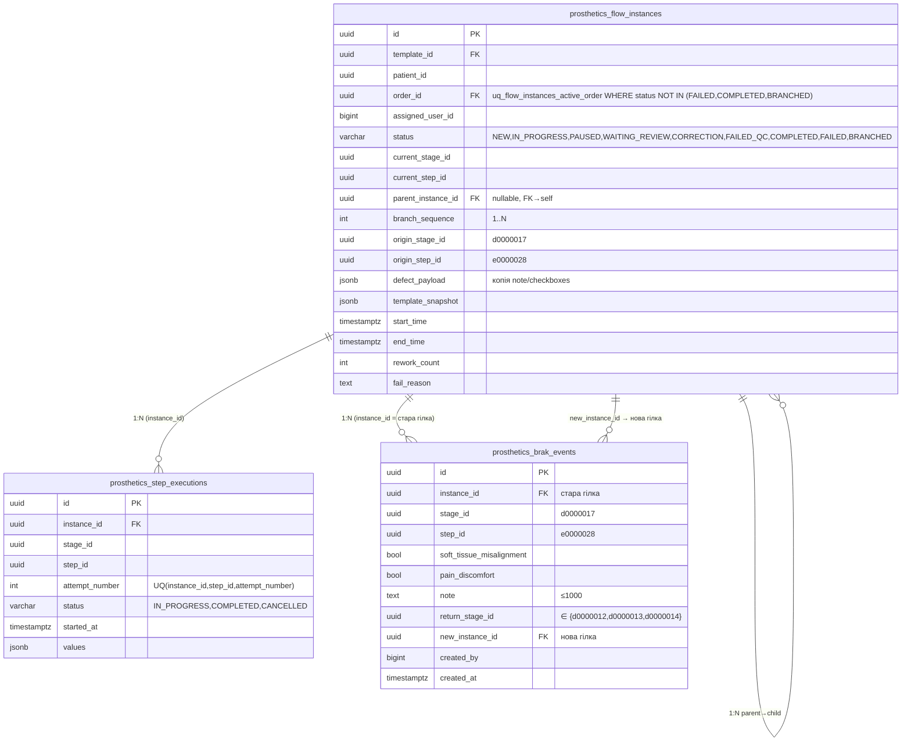

# Проєктування механізму гілок та повернення для «Брак» — TP-LL-02 (Issue #204)

> **Дата:** 2026-09-01 · **Статус:** `DESIGN ACCEPTED` · **Базується на:** `docs/ADR-002-Brak-Branching.md`, `docs/TP-LL-02-Brak-Analysis-Issue-203.md`
> **Ціль (Phase 1):** `e0000028` (етап `d0000017`) → дозволене повернення на `{d0000012, d0000013, d0000014}` з фіксацією дефекту та створенням нової гілки.
> **Розширення Phase 2 (ТЗ №1, етап 9):** див. `docs/ADR-002-Brak-Branching.md` §3.4 та Issue #212/#215 — додано тригер `(d0000020, e0000032)` «Примірювання та коректування постійного протеза» з тими самими етапами повернення; механізм гілок без змін.

---

## 1. Branch-модель — рішення (§4 Issue #204)

**Прийнято Варіант A** (див. ADR-002 §2-3): `FlowInstance.parent_instance_id + branch_sequence + origin_stage/step_id` + `prosthetics_brak_events(1:N)`, стара гілка `BRANCHED`.

**Поточний список файлів розділу:** `FlowInstance.java`, `FlowInstanceStatus.java`, `BrakEvent.java`, `BrakEventRepository`, `db/changelog/prosth/005-brak-branch.sql`.

---

## 2. API design

### 2.1 `POST /api/prosthesis-manufacturing/instances/{id}/brak`

*Атомарний одним викликом — фіксація + створення гілки в одній `@Transactional` (менше race ніж двокроковий `POST /brak` + `POST /brak/branch`).*

**Request DTO `BrakCreateRequest`**

```java
public record BrakCreateRequest(
  @NotNull UUID returnStageId,                          // ∈ ALLOWED_RETURN_STAGE_IDS
  boolean softTissueMisalignment,                        // «Неправильне розташування…» checkbox
  boolean painDiscomfort,                                // «Наявні больові відчуття…» checkbox
  @Size(max=1000) String note                            // Textarea «Примітка», trim, nullable
) {}
```

`returnStageId` — `UUID` одного з:
```
d0000012-0000-0000-0000-000000000012  Виготовлення гіпсового негатива (Етап 1)
d0000013-0000-0000-0000-000000000013  Виготовлення гіпсової моделі кукси (Етап 2)
d0000014-0000-0000-0000-000000000014  Виготовлення тренувальної гільзи (Етап 3)
```
Жоден інший `UUID` (в т.ч. `d0000015/016/017`) — `400 BUSINESS_RULE "Недозволений етап повернення"`.

**Response `BranchResponse` (201 Created)**

```json
{
  "brakEventId":   "b000…",
  "originalInstanceId": "aaa…",
  "newInstanceId": "bbb…",
  "returnStageId": "d0000012-0000-0000-0000-000000000012",
  "returnStageName":"Виготовлення гіпсового негатива",
  "newStatus": "NEW"
}
```

Альтернатива (для сумісності з існуючим `FlowInstanceResponse`): `201 FlowInstance` нової гілки + `Location: /instances/{newId}`. Обрано `BranchResponse` — явніший для FE (`navigate(/prosthetics/process/{newInstanceId}/wizard)`).

**Валідація (hard gates, порядок):**

1. `instance = requireOwner(id, userId)` → `404` якщо чужий (як `FlowInstanceService.requireOwner:777`).
2. `instance.status == IN_PROGRESS` → інакше `400 "Брак можливий лише під час виконання"` (не `PAUSED/COMPLETED/FAILED/BRANCHED`).
3. `instance.currentStageId == d0000017 && instance.currentStepId == e0000028` → інакше `400 "Брак доступний лише на кроці 1 етапу 6"`.
4. `ALLOWED_RETURN_STAGE_IDS.contains(returnStageId)` та `exists in snapshot.stages` → інакше `400 BUSINESS_RULE`.
5. `@Size(max=1000)` на `note` → `400` (Bean Validation).
6. `templateSnapshot.parse` — `BAD_REQUEST` якщо зіпсовано (рідко).

**Авторизація:** `@PreAuthorize("@permissionService.has('PROSTHETICS_STEP_COMPLETE')")` + `requireOwner` (як `fail/replacement/backward:155-169`).

**Коди:**

| Код | Коли |
|---|---|
| `201` | створено `BrakEvent` + стара→`BRANCHED` + нова `NEW` |
| `400 BUSINESS_RULE` | `returnStageId` не з allow-list або `status/step` не відповідає |
| `400` | `note` too long, `returnStageId==null` |
| `404` | чужий `instance` (маскує 403) |
| `409` | optimistic `version` конфлікт (`@Version` в `BaseEntity`) |

### 2.2 `GET /api/prosthesis-manufacturing/instances/{id}/brak-events`

```java
@GetMapping("/{id}/brak-events")
@PreAuthorize("@permissionService.hasAny('PROSTHETICS_DASHBOARD','MODULE_PROSTHETICS_ACCESS')")
public List<BrakEventResponse> listBrakEvents(@PathVariable UUID id)
```

`BrakEventResponse` — `id, instanceId, stageId, stepId, softTissueMisalignment, painDiscomfort, note, returnStageId, returnStageName, newInstanceId, createdBy, createdAt`.

### 2.3 `GET /api/prosthesis-manufacturing/instances/{id}/branches`

```java
@GetMapping("/{id}/branches")
public List<FlowInstanceResponse> listBranches(@PathVariable UUID id)
```

`FlowInstanceRepository.findByParentInstanceId(id)` — список child гілок (зазвичай 1).

### 2.4 OpenAPI фрагмент

```yaml
paths:
  /api/prosthesis-manufacturing/instances/{id}/brak:
    post:
      tags: [Flow instances]
      security: [bearerAuth: []]
      parameters: [{name: id, in: path, required: true, schema: {type: string, format: uuid}}]
      requestBody:
        required: true
        content:
          application/json:
            schema:
              type: object
              required: [returnStageId]
              properties:
                returnStageId: {type: string, format: uuid, enum: [d0000012-…, d0000013-…, d0000014-…]}
                softTissueMisalignment: {type: boolean, default: false}
                painDiscomfort: {type: boolean, default: false}
                note: {type: string, maxLength: 1000, nullable: true}
      responses:
        '201': {description: Created, content: {application/json: {schema: {$ref: '#/components/schemas/BranchResponse'}}}}
        '400': {description: BUSINESS_RULE / validation}
        '404': {description: Instance not found or not owner}
```

---

## 3. Persistence design

### 3.1 DDL `prosth/005-brak-branch.sql`

```sql
--liquibase formatted sql

--changeset split-prosth:17
ALTER TABLE prosthetics_flow_instances ADD COLUMN IF NOT EXISTS parent_instance_id UUID REFERENCES prosthetics_flow_instances(id);
ALTER TABLE prosthetics_flow_instances ADD COLUMN IF NOT EXISTS branch_sequence INTEGER DEFAULT 1;
ALTER TABLE prosthetics_flow_instances ADD COLUMN IF NOT EXISTS origin_stage_id UUID;
ALTER TABLE prosthetics_flow_instances ADD COLUMN IF NOT EXISTS origin_step_id UUID;
ALTER TABLE prosthetics_flow_instances ADD COLUMN IF NOT EXISTS defect_payload JSONB;
CREATE INDEX IF NOT EXISTS idx_flow_instances_parent ON prosthetics_flow_instances(parent_instance_id);
--rollback DROP INDEX IF EXISTS idx_flow_instances_parent;
--rollback ALTER TABLE prosthetics_flow_instances DROP COLUMN IF EXISTS defect_payload;
--rollback ALTER TABLE prosthetics_flow_instances DROP COLUMN IF EXISTS origin_step_id;
--rollback ALTER TABLE prosthetics_flow_instances DROP COLUMN IF EXISTS origin_stage_id;
--rollback ALTER TABLE prosthetics_flow_instances DROP COLUMN IF EXISTS branch_sequence;
--rollback ALTER TABLE prosthetics_flow_instances DROP COLUMN IF EXISTS parent_instance_id;

--changeset split-prosth:18
CREATE TABLE IF NOT EXISTS prosthetics_brak_events (
  id UUID NOT NULL,
  instance_id UUID NOT NULL,
  stage_id UUID NOT NULL,
  step_id UUID NOT NULL,
  soft_tissue_misalignment BOOLEAN NOT NULL DEFAULT FALSE,
  pain_discomfort BOOLEAN NOT NULL DEFAULT FALSE,
  note TEXT,
  return_stage_id UUID NOT NULL,
  new_instance_id UUID REFERENCES prosthetics_flow_instances(id),
  created_at TIMESTAMP NOT NULL DEFAULT NOW(),
  created_by BIGINT NOT NULL DEFAULT 0,
  updated_at TIMESTAMP NOT NULL DEFAULT NOW(),
  updated_by BIGINT NOT NULL DEFAULT 0,
  version INTEGER NOT NULL DEFAULT 0,
  is_deleted BOOLEAN DEFAULT FALSE,
  CONSTRAINT pk_prosthetics_brak_events PRIMARY KEY (id),
  CONSTRAINT fk_brak_events_instance FOREIGN KEY (instance_id) REFERENCES prosthetics_flow_instances(id),
  CONSTRAINT fk_brak_events_new_instance FOREIGN KEY (new_instance_id) REFERENCES prosthetics_flow_instances(id),
  CONSTRAINT chk_brak_note_len CHECK (note IS NULL OR length(note) <= 1000)
);
CREATE INDEX IF NOT EXISTS idx_brak_events_instance ON prosthetics_brak_events(instance_id);
CREATE INDEX IF NOT EXISTS idx_brak_events_new_instance ON prosthetics_brak_events(new_instance_id);
--rollback DROP TABLE prosthetics_brak_events;

--changeset split-prosth:19
DROP INDEX IF EXISTS uq_flow_instances_active_order;
CREATE UNIQUE INDEX uq_flow_instances_active_order
  ON prosthetics_flow_instances(order_id)
  WHERE status NOT IN ('FAILED','COMPLETED','BRANCHED');
--rollback DROP INDEX IF EXISTS uq_flow_instances_active_order;
--rollback CREATE UNIQUE INDEX uq_flow_instances_active_order ON prosthetics_flow_instances(order_id) WHERE status NOT IN ('FAILED','COMPLETED');
```

`db.changelog-master-prosth.yaml:14` → `file: prosth/005-brak-branch.sql`.

Міграція існуючих даних: усі `parent_instance_id = null`, `branch_sequence = 1`, `origin_* = null`. `is_deleted`/`version` — як у всіх `BaseEntity`.

### 3.2 ER-діаграма



`StepExecution` старої гілки — append-only, не видаляється; нова гілка — свої `StepExecution` з `attemptNumber=1` для `firstStepOf(returnStage)`.

> **Note (QG-Removal, issues #229–#234):** статуси `WAITING_REVIEW` / `CORRECTION` / `FAILED_QC` та колонка `rework_count` у діаграмі вище видалено з продукту; потік лінійний.

---

## 4. UI design (§3, §5, §8) — Wireframe

### 4.1 Послідовність

```
WizardScreen (IN_PROGRESS, e0000028, d0000017)
  │
  ├─ sticky bottom-bar ─┬─ [Пауза] [Позначити як провалений] [Брак ★ destructive ghost, XCircle] [До головн.] ─┤
  │                     └─ {isBrakStep && <Button variant="destructive" className="min-h-11">Брак</Button>} ─┘
  │
  ▼ click «Брак»
Dialog 1 — «Брак» (Dialog mobileFullscreen,  `WizardScreen.tsx:2049` патерн failOpen)
  ┌─────────────────────────────────────────┐
  │ DialogTitle: Брак                       │
  │ DialogDescription: Якість посадки…      │
  │ ─────────────────────────────────────  │
  │ ☐ Неправильне розташування м’яких…   │  CheckboxRow id=brak-soft-tissue (label htmlFor whole-surface)
  │ ☐ Наявні больові відчуття…            │  CheckboxRow id=brak-pain
  │ ─────────────────────────────────────  │
  │ Label «Примітка» + Textarea rows=3     │  id=brak-note placeholder="Введіть примітку..." maxLength=1000
  │ ─────────────────────────────────────  │
  │ [Скасувати outline]  [Підтвердити]    │  DialogFooter, Підтвердити → close D1 → open D2
  └─────────────────────────────────────────┘
  │
  ▼ «Підтвердити»
Dialog 2 — «Повернутись на етап:» (RadioGroup)
  ┌─────────────────────────────────────────┐
  │ DialogTitle: Повернутись на етап:       │
  │ ○ Виготовлення гіпсового негатива (Етап 1)      │  RadioGroupItem value=d0000012
  │ ○ Виготовлення гіпсової моделі кукси (Етап 2)   │  value=d0000013
  │ ○ Виготовлення тренувальної гільзи (Етап 3)     │  value=d0000014
  │ (жоден інший етап не рендерити)                │
  │ ─────────────────────────────────────  │
  │ [Назад]  [Створити гілку]              │  «Створити гілку» = POST /brak {soft,pain,note,returnStageId}
  └─────────────────────────────────────────┘
  │
  ▼ success 201 BranchResponse
toast «Створено нову гілку з етапу “Виготовлення …”» + navigate(/prosthetics/process/{newInstanceId}/wizard)
Стара гілка — BRANCHED, доступна via Dashboard (статус «Розгалужено») + History «Події браку» лінк → нова
```

### 4.2 shadcn/ui компоненти (вже в проєкті)

`Dialog`+`DialogContent mobileFullscreen` (`dialog.tsx:42-`), `Checkbox` (`checkbox.tsx`) з `CheckboxRow` (`WizardScreen.tsx:147` `label htmlFor` whole-surface), `Textarea`/`Input`, `RadioGroup`/`RadioGroupItem` (`radio-group.tsx`), `Button` (`variant=destructive` для «Брак», `pointer-coarse:min-h-11`), `Label`, `Separator`, `Badge`.

Токени `index.css @theme --destructive:#FF5252 --ring:#FF5F33`, `prefers-reduced-motion` гейт `index.css:338` — успадковується.

### 4.3 Стани

`brakOpen, returnDialogOpen, brakSoftTissue, brakPain, brakNote, brakReturnStageId, brakSubmitting` — як `failOpen:1332` патерн.

---

## 5. Паралельність & транзакції (§6)

```java
@Transactional
public BranchResponse createBrakAndBranch(UUID instanceId, BrakCreateRequest req, Long userId) {
  FlowInstance instance = instanceRepository.findByIdForUpdate(instanceId) // PESSIMISTIC_WRITE
                          .orElseThrow(...);
  requireOwner(instanceId, userId); // або reuse instance
  // 2. status, step, allow-list валідація
  BrakEvent event = brakEventRepository.save(BrakEvent{instance_id, stage_id=d0000017, step_id=e0000028, ...});
  instance.status = BRANCHED; instance.originStageId = d0000017; instance.endTime = now; save;
  FlowInstance branch = FlowInstance{parentInstanceId=instance.id, branchSequence=max+1,
          templateId=instance.templateId, orderId=instance.orderId, patientId=instance.patientId,
          status=NEW, currentStageId=req.returnStageId, currentStepId=firstStepOf(req.returnStageId),
          templateSnapshot=instance.templateSnapshot, assignedUserId=userId, ...}; save;
  event.newInstanceId = branch.id; save;
  createExecution(branch, returnStageId, firstStepId, 1, now); // StepExecution IN_PROGRESS
  audit 3×: BrakEvent CREATE, FlowInstance BRANCHED, FlowInstance BRANCH_CREATE
  return BranchResponse;
}
```

`version` optimistic — `409` при race двох «Брак» на одному `instance_id` (другий побачить `status!=IN_PROGRESS` → `400`).

`uq_flow_instances_active_order` дозволяє нову гілку бо стара вже `BRANCHED` (в `NOT IN`).

---

## 6. Audit / History (§10 ТЗ)

- `AuditService.logAction("BrakEvent", eventId, "CREATE", userId)` + `logAction("FlowInstance", oldId, "BRANCH", userId)` + `logAction("FlowInstance", newId, "CREATE_BRANCH", userId)` — 3 записи, `isDeleted=false`.
- `StepExecution` — append-only, стара гілка не чиститься.
- `GET /brak-events` + `GET /branches` — для `ProcessHistoryPage` («Події браку» + «Гілки»).
- PDF — стара `BRANCHED` генерує як `FAILED` (failure-подібний) або окремий `BRANCHED` тип (follow-up, не в Issue #204).

---

## 7. Error handling

| Випадок | HTTP | Код | Повідомлення |
|---|---|---|---|
| чужий `instance` | 404 | NOT_FOUND | `Instance not found` (маскує 403) |
| `status != IN_PROGRESS` | 400 | BUSINESS_RULE | `Брак можливий лише під час виконання` |
| `step != e0000028` | 400 | BUSINESS_RULE | `Брак доступний лише на кроці 1 етапу 6` |
| `returnStageId` не в allow-list | 400 | BUSINESS_RULE | `Недозволений етап повернення. Дозволені: …` |
| `returnStageId` не в snapshot | 400 | BUSINESS_RULE | `Stage is missing from the template snapshot` |
| `note.length >1000` | 400 | VALIDATION | Bean Validation |
| `version` конфлікт | 409 | VERSION_CONFLICT | Optimistic lock |

---

## 8. Міграція

`split-prosth:17-19` — `ALTER TABLE`, `CREATE TABLE`, `REINDEX`. Rollback — `DROP TABLE/INDEX` (див. §3.1). `DATABASECHANGELOG` — include `005-brak-branch.sql`. Існуючі дані — `parent_instance_id=null`.

---

## 9. Посилання

- ADR-002 §3 (статус `BRANCHED`)
- `docs/TP-LL-02-Brak-Analysis-Issue-203.md:§5` (R1)
- Issue #204 scope §1-6, Issues #205-207 (тести)
