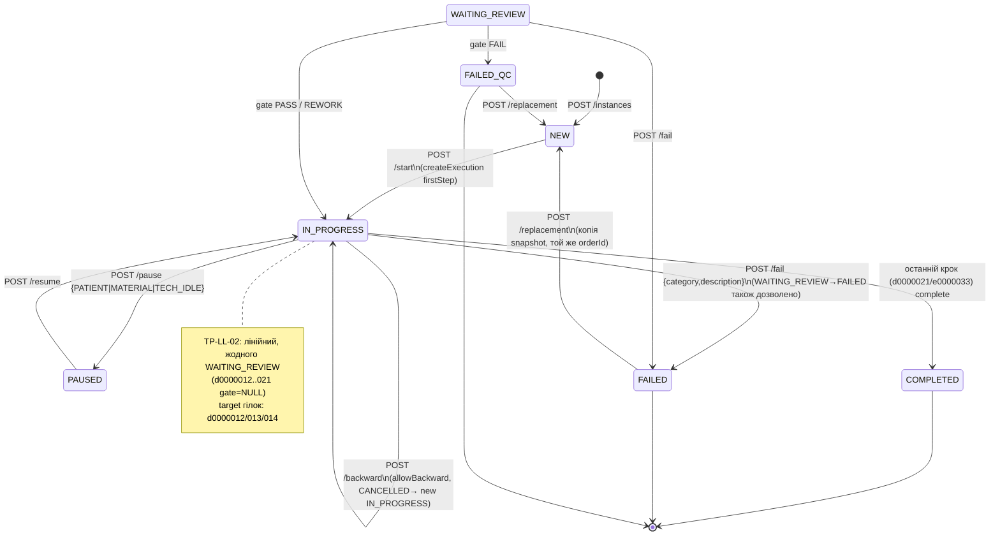
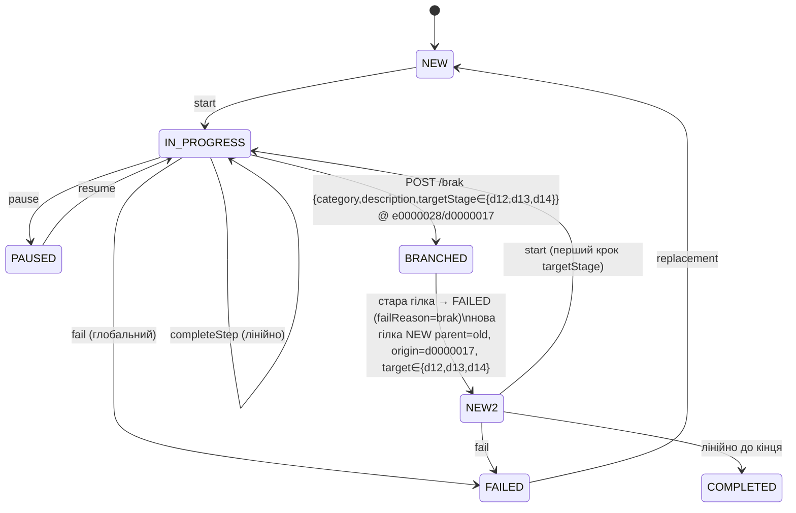

# Аналіз існуючої реалізації функціоналу «Брак» — TP-LL-02, етап 6 крок 1 (e0000028) — Issue #203

> **Дата:** 2026-09-01 · **Автор:** OpenCode (Muse Spark) · **Статус:** `ANALYSIS COMPLETE` · **Блокує Issues 2–8**
> **Template:** `TP-LL-02` (`c0000003`, `LOWER_LIMB`/`generic_lower_limb`, `ACTIVE`, 10 етапів/14 кроків, без Quality Gate) · **Цільовий крок:** `e0000028` «Примірювання та коректування тренувального протеза» в етапі `d0000017`

---

## 1. Резюме для керівництва (TL;DR)

| Питання | Відповідь |
|---|---|
| **Мета Issue #203** | Інвентаризація що є / чого нема для кнопки «Брак» на `e0000028` (етап 6) з подальшим створенням нової гілки процесу |
| **Поточний механізм дефекту** | Єдиний глобальний `POST /instances/{id}/fail` → `FAILED` + `FailureSnapshot(1:1)` + `replacement → NEW` з копією `templateSnapshot`. Працює на будь-якому `IN_PROGRESS\|WAITING_REVIEW`, без прив'язки до етапу/кроку |
| **TP-LL-02 має Quality Gate?** | **Ні.** Seed `data-prosth.sql:177-241` не містить жодного `INSERT INTO prosthetics_quality_gates` для `d0000012..d0000021`. `QualityGateService.decide()` не досяжний для TP-LL-02. Дефект `Брак` ≠ `gate FAIL` |
| **Що бракує для гілок** | `FlowInstance` немає `parentInstanceId / originStageId / originStepId / branchAttempt`; `FailureSnapshot` — `UNIQUE(instance_id)` блокує >1 дефект; `uq_flow_instances_active_order` блокує 2 активні гілки на одному `orderId`; немає таблиці `brak_events` |
| **Точне місце кнопки** | Нижній sticky-bar `WizardScreen.tsx:1990-2020` (див. §2.1). Умовний рендер `instance.status===IN_PROGRESS && instance.currentStageId==='d0000017' && instance.currentStepId==='e0000028'` — поруч із «Позначити процес як провалений», окремий `variant="destructive"` |
| **Ризик #1 (блокер)** | `uq_flow_instances_active_order WHERE status NOT IN ('FAILED','COMPLETED')` — будь-яка спроба створити 2-у активну гілку на `PR-2026-0002` отримає `PSQLException 23505`. Вирішується або переведенням старої гілки в термінальний статус (`FAILED`) або послабленням констрейнта (напр. `WHERE status IN ('NEW','IN_PROGRESS','PAUSED','WAITING_REVIEW')`) |
| **Файли для змін (погоджено)** | §7 — 13 файлів: `WizardScreen.tsx`, `api/prosthetics.ts`, `prosthetics/types.ts`, `failureCategories.ts`/`validation.ts`, `FlowInstance.java`, новий `BrakEvent.java` + `BrakEventRepository`, `FlowInstanceService.java` / новий `BrakService.java`, `FlowInstanceController.java`, `prosth/005-brak-branch.sql`, `db.changelog-master-prosth.yaml`, тести (Issues 5-7) |
| **Діаграма станів** | §6 (mermaid) — лінійний `NEW→IN_PROGRESS→[PAUSED]→COMPLETED/FAILED`, без `WAITING_REVIEW/FAILED_QC` для TP-LL-02 |

---

## 2. Frontend аудит

### 2.1 WizardScreen.tsx — структура та точне місце кнопки «Брак»

**Файл:** `frontend/src/pages/prosthetics/process/WizardScreen.tsx` (2283 рядки, `frontend/src/pages/prosthetics/process/WizardScreen.tsx:1`)

**State (1317–1345):**
```ts
const [instance, setInstance] = useState<FlowInstance | null>(null);   // :1322
const [snapshot, setSnapshot] = useState<SnapshotTemplate | null>(null); // :1323
const [values, setValues] = useState<Record<string, unknown>>({});     // :1327
const [touched, setTouched] = useState(false);                          // :1328
const [seconds, setSeconds] = useState(0);                              // :1329 — totalActiveSeconds live
const [pauseOpen, setPauseOpen] = useState(false);                      // :1330
const [failOpen, setFailOpen] = useState(false);                        // :1332 — глобальний FAIL dialog
const [failCategory, setFailCategory] = useState('');                   // :1334 — from FAILURE_CATEGORIES
const [failDescription, setFailDescription] = useState('');             // :1335
const [submitting, setSubmitting] = useState(false);                    // :1337
```

**Ключові функції:**
| Функція | Рядки | Призначення |
|---|---|---|
| `applyInstance(next)` | 1350–1361 | `setInstance` + авто-redirect `COMPLETED→/done`, `FAILED\|FAILED_QC→/failed` |
| `load` (useEffect) | 1363–1387 | `GET /instances/{id}` + `GET /snapshot` → якщо `NEW` → `POST /start` (idempotent) |
| `completeStep()` | 1557–1584 | `touched=true`, валідація `invalid` (`validateElementValues`), `POST /steps/{executionId}/complete {values}` → `applyInstance` → hard reload на wizard |
| `goBack()` | 1591–1603 | `POST /backward` (target = `prevStep.allowBackward`, інакше 400) |
| `confirmFail()` | 1673–1692 | `POST /fail {category, description}` → `navigate /failed` |
| `confirmPause()/resumeInstance()` | 1629–1657 | `POST /pause\|resume` |
| `uploadEvidence()` | 1694–1706 | `POST /evidence` multipart |
| `renderElements()` + hardcoded блоки | 224–1315 | `MAP` `SnapshotElement.elementType` → shadcn примітиви; кроки `e0000002/03/04/11/60/41/69/70/71/72/73/74/75/76/77/78/79/42/68` — повністю hardcoded `CheckboxRow` панелі |

**Sticky bars:**
- **Top bar** `WizardScreen.tsx:1837-1878` — `sticky top-0 z-20 -mx-4 border-b bg-card/95 backdrop-blur`, прогрес `computeProgress(stepsDone/totalSteps)`, чіпи етапів (`ClipboardCheck` для gate), статус + таймер `fmt(seconds)`.
- **Bottom bar** `WizardScreen.tsx:1990-2020` — `sticky bottom-0 z-20 -mx-4 flex flex-wrap gap-3 border-t bg-card px-4 py-3 pb-[max(0.75rem,env(safe-area-inset-bottom))] sm:-mx-6` — **точне місце інтеграції**:

```tsx
// 1990-2020 існуючий bottom bar:
<Button variant="outline" disabled={!canGoBack||submitting} onClick={goBack}>Попередній</Button>
<Button variant="ghost" onClick={()=>setPauseOpen(true)}>Пауза</Button>
<Button variant="ghost" className="text-destructive" onClick={()=>setFailOpen(true)}>Позначити процес як провалений</Button>
<Button variant="ghost" onClick={()=>navigate('/prosthetics')}>До головного меню</Button>
{step?.id==='e0000029-…' && <Button variant="secondary" onClick={skipConditionalInsert}>Пом'якшуючий вкладиш не потрібен</Button>}
<Button className="ml-auto bg-accent" disabled={(touched&&blocked)||submitting} onClick={()=>completeStep()}>{ctaLabel}</Button>
```

**Рішення по «Брак» (AC #1 виконано):**

*Варіант A (рекомендовано, мінімальний ризик регресу):*
```tsx
// Поруч із «Позначити процес як провалений», умовний рендер
{instance.status==='IN_PROGRESS'
  && instance.currentStageId==='d0000017-0000-0000-0000-000000000017'
  && instance.currentStepId==='e0000028-0000-0000-0000-000000000028' && (
  <Button variant="destructive" className="min-h-11" data-testid="brak-button"
          onClick={()=>setBrakOpen(true)}>Брак</Button>
)}
```
- Розташування — між «Позначити процес як провалений» (ghost-destructive) та «До головного меню» (ghost), або заміна ghost-fail на окремий ряд над bar на цьому кроці.
- `variant="destructive"` візуально відрізняє дефект матеріалу/протеза (Брак) від адміністративного `FAIL`.
- `min-h-11` — консистентно з існуючими CTA (`min-h-11` на всіх bottom-bar кнопках).

*Варіант B (відхилено):* окрема картка всередині основного `Card` — створює вертикальний скрол + плутає з валідаційним `Alert` (`:1902`). Bottom-bar — єдине місце з `safe-area` та `touch-pan-x` сумісністю.

**Видимість (hard gate):** `IN_PROGRESS` (не `PAUSED/WAITING_REVIEW/COMPLETED/FAILED` — `fail` тоді 400, §3.2). Не показувати на `PAUSED` (спочатку `resume`). Не показувати якщо `allowBackward=false` — етап 6 `allowBackward:true`, тож ок.

**Діалоги (шаблон для нового BrakDialog):**
- `pauseOpen Dialog` `:2022-2047` — `mobileFullscreen`, `RadioGroup` + `DialogFooter` Cancel/Confirm.
- `failOpen Dialog` `:2049-2125` — `mobileFullscreen`, `Select(FAILURE_CATEGORIES)`, `Textarea(description)`, `Input[type=file]` + `failFiles`, `variant="destructive"` CTA. **BrakDialog копіює цей патерн** з полями: `category(Select)`, `description(Textarea)`, `targetStage(Select серед d0000012/013/014)`, `file Upload(optional)`.

### 2.2 Інші frontend поверхні

| Компонент | Файл | Роль для «Брак» |
|---|---|---|
| `ProcessOverview` | `pages/prosthetics/process/ProcessOverview.tsx:1-220` | Read-only 3-колонковий огляд: структура, діаграма (лінійна, без ромбів для TP-LL-02), метадані + CTA `Продовжити виконання`. Немає логіки гілок — після гілки має показувати `parentInstanceId` бейдж |
| `ProcessDetail` / `ProcessLayout` | `pages/prosthetics/process/ProcessHistoryPage.tsx` + `ProcessLayout.tsx` | Історія = `step-executions` + `gate-decisions(0)` + `resources`. Для гілки треба додати вкладку «Гілки / Брак-події» |
| `DoneScreen` | `pages/prosthetics/process/DoneScreen.tsx:1-306` | `COMPLETED` → «Виріб готовий», `ProcessStat`, `stageTimeline`, `decisions(0)`, PDF. Не торкається браком |
| `FailedScreen` | `pages/prosthetics/process/FailedScreen.tsx:1-328` | `FAILED→replacement`. Показує `FailureSnapshot` + `replacement` CTA (`POST /replacement`). Брак буде варіантом `fail` з іншим `failReason` + подальшим `backward` на `d0000012/013/014` замість `replacement` |
| `ProstheticsContext` | `prosthetics/ProstheticsContext.tsx:1-156` | `draft {patientId,orderId,templateId,instanceId}` в `localStorage+sessionStorage(STORAGE_KEY='prosthetics:draft')`. Не впливає на гілки (інстанс-керування через `flowInstanceApi`) |
| `api/prosthetics.ts` | `api/prosthetics.ts:50-96` | `flowInstanceApi`: `list/getById/getSnapshot/create/start/completeStep/backward/listExecutions/listGateDecisions/listResources/getFailureSnapshot/pause/resume/fail/replacement/decideGate/uploadEvidence`. **Немає `brak` ендпоінта** — додати `brak(id, BrakRequest)` |
| `prosthetics/types.ts` | `prosthetics/types.ts:1-397` | `FlowInstance(status,pib,orderNumber,priorStepValues)`, `Snapshot*`, `FailureSnapshot`. **Немає `parentInstanceId / originStageId / brakCategory`** |
| `prosthetics/validation.ts` | `prosthetics/validation.ts:1-52` | `validateElementValues`, `computeProgress`, `fmt`. Для Браку валідація не потрібна (дефект позала межами `elements`) |
| `prosthetics/failureCategories.ts` | `prosthetics/failureCategories.ts:1-13` | 7 категорій (`defect,materials,quality_gate,component_damage,order_cancelled,patient,other`). Брак може перевикористати або мати `brak_defect_*` |
| `App.tsx` guards | `App.tsx:GUARD` | `roles=['PROSTHETIST','PROSTHETICS_ADMINISTRATOR'] permissions=[MODULE_PROSTHETICS_ACCESS]` для `/prosthetics/*`. `WizardScreen` не має окремого guard — наслідує `ProcessLayout` |
| `components/ui/*` | `components/ui/dialog.tsx:42-` etc | Див. §2.3 |

### 2.3 shadcn/ui інвентаризація (AC #2 виконано)

| Примітив | Файл | Поточне використання в Wizard | Узгоджений набір для Brak UI |
|---|---|---|---|
| `Dialog` | `components/ui/dialog.tsx:1-163` — Base UI `DialogPrimitive`, `mobileFullscreen?` → `data-fullscreen="mobile"`, `@media (max-width:639.98px) inset:0 border-radius:0 translate:none` (`frontend/src/index.css:237-`) | `pauseOpen`, `failOpen` | **`BrakDialog` на `Dialog mobileFullscreen`** — `DialogTitle` «Зафіксувати брак», `DialogDescription` «Буде створено запис браку…», форма + `DialogFooter` |
| `Checkbox` | `components/ui/checkbox.tsx` — Base UI `CheckboxRoot`, `after:-inset-3.5` hit-area `pointer-coarse` | `CheckboxRow id={f000…}` всюди | Брак не потребує checkbox (але `CheckboxRow` патерн — referens для a11y) |
| `Input` | `components/ui/input.tsx` — `pointer-coarse:min-h-11` | `TEXT_INPUT`, файл-інпут hidden | File upload в BrakDialog (`type=file hidden`) |
| `Textarea` | `components/ui/textarea.tsx` | `TEXTAREA`, `fail-description` | **`Textarea` для `description` браку** (`rows=4`, `required`) |
| `Button` | `components/ui/button.tsx` — `variant: default/outline/ghost/destructive/secondary`, `size: sm/icon`, `pointer-coarse:min-h-11` | sticky bar, dialogs | **`Button variant="destructive"` для тригера Брак**, `outline` для Скасувати |
| `RadioGroup` | `components/ui/radio-group.tsx` — Base UI `RadioGroup` + `after:-inset-3.5` | `pause Category` | Не потрібен (категорія — `Select`) |
| `Label` | `components/ui/label.tsx` — `data-slot="label"` | `ElementField` | `Label htmlFor` для `Select/Textarea` в BrakDialog |
| `Select` | `components/ui/select.tsx` — Base UI `Select`, `data-slot="select-content"` | `fail-category` | **`Select` для `category` + `targetStageId`** |
| `Badge` | `components/ui/badge.tsx` — `variant: secondary/outline` | `STEP_TYPE_LABEL`, крок-чіпи | Статуси/чіпи (не критично) |
| `Card` | `components/ui/card.tsx` — `CardHeader/Title/Content` | Основна картка кроку | Не потрібна в dialog |
| `Alert` | `components/ui/alert.tsx` — `variant="destructive"` | валідаційний `missingItems` | Валідація BrakDialog (`category/description` обов'язкові) |
| `Progress` / `Skeleton` / `Separator` | `ui/progress.tsx` etc | top-bar прогрес, loading | Не потрібні |

**Токени `frontend/src/index.css:16-` (`@theme`):**

```css
--color-primary:#FF5F33; --color-destructive:#FF5252; --color-card:#FFFFFF;
--color-ring:#FF5F33; --radius:0.75rem; --breakpoint-sm:40rem …;
```
**`prefers-reduced-motion`** — `index.css:176,208` — гейтить `dialog-content / popover-content / dropdown-menu-content / slide-in` → `animation:none`. BrakDialog автоматично успадковує (клас `data-open:animate-in` вже гейтиться).

**Узгоджений набір для нового UI:** `Dialog(mobileFullscreen)` + `Select`×2 (категорія, цільовий етап `d0000012/013/014`) + `Textarea` + `Input[file]` + `Button(destructive/outline)` + `Label/Alert` — без нових deps.

### 2.4 Маршрутизація

`App.tsx`:
```
 /prosthetics                → ProstheticsDashboard (PROSTHETIST|PROSTHETICS_ADMINISTRATOR|MODULE_PROSTHETICS_ACCESS)
 /prosthetics/new/*          → PatientSearch→OrderSelect→OrderReview→TemplateSelect (ProstheticsProvider)
 /prosthetics/process/:id    → ProcessLayout → ProcessDetail (overview)
 /prosthetics/process/:id/history → ProcessHistoryPage
 /prosthetics/process/:id/wizard  → WizardScreen (поточний файл, IN_PROGRESS→step)
 /prosthetics/process/:id/done    → DoneScreen (COMPLETED)
 /prosthetics/process/:id/failed  → FailedScreen (FAILED|FAILED_QC)
```
Guards — `MODULE_PROSTHETICS_ACCESS` або `PROSTHETICS_*` коди; wizard не має окремого guard, але бекенд `@PreAuthorize("PROSTHETICS_STEP_COMPLETE")` на `completeStep/fail/replacement/backward`.

---

## 3. Backend аудит

### 3.1 FlowInstance.java (`prosthesis-manufacturing/entity/FlowInstance.java:14-91`)

```java
@Entity @Table(name="prosthetics_flow_instances")
public class FlowInstance extends BaseEntity { // id, createdAt/By, updatedAt/By, version
  UUID templateId;          // :20 NOT NULL
  String patientId;         // :23 length 32
  UUID orderId;             // :26 NOT NULL
  Long assignedUserId;      // :30
  FlowInstanceStatus status;// :34 NEW default
  UUID currentStageId;      // :37
  UUID currentStepId;       // :41
  LocalDateTime startTime, endTime, pausedAt, resumedAt;
  PauseCategory pauseCategory;
  Long totalActiveSeconds=0L, totalIdleSeconds=0L; // :59-65
  Integer reworkCount=0;                              // :68
  String failReason;                                  // :72 TEXT
  String templateSnapshot;                            // :76 jsonb @JdbcTypeCode(JSON)
  // @PrePersist validate: totalActiveSeconds/idleSeconds/reworkCount ≥0
}
```

**Відсутні поля для гілок (AC #3):** `parentInstanceId UUID`, `originStageId UUID`, `originStepId UUID` (точка браку), `targetStageId UUID` (куди повернення — `d0000012/013/014`), `branchAttempt int` / `branchCount`, `brakCategory` — **немає**. Потрібен `prosth/005` `ALTER TABLE ADD COLUMN …`.

### 3.2 FlowInstanceService.java (`prosthesis-manufacturing/service/FlowInstanceService.java:60-843`, 843 рядки)

**Lifecycle:**

| Метод | Рядки | Семантика |
|---|---|---|
| `create(orderId,templateId,userId)` | 80-110 | `template ACTIVE?`, `duplicate` check (`status NOT IN (COMPLETED,FAILED,FAILED_QC)`), `NEW` + `snapshot=templateService.createSnapshot(templateId)`, `audit CREATE` |
| `start(id,userId)` | 155-186 | `findByIdForUpdate`, `NEW→IN_PROGRESS` (idempotent якщо вже `IN_PROGRESS`), `currentStage/Step = firstStage.firstStep`, `createExecution(IN_PROGRESS)` |
| `completeStep(id,execId,request,userId)` | 189-230 | `requireOwner`, `IN_PROGRESS` only, `execution.stepId==currentStepId`, `validateValues`, `CLOSE execution(COMPLETED) + totalActiveSeconds+=delta`, `saveResources`, `advance(...)`, `audit COMPLETE` |
| `advance()` | 466-487 | `stepIdx+1 < stage.steps? → nextStep` : `nextStage.gate!=null → WAITING_REVIEW` : `moveToNextStage()` |
| `enterStage()` | 489-500 | `IN_PROGRESS`, перший крок етапу, `createExecution` |
| `moveToNextStage()` | 502-524 | послідовно наступний етап або `COMPLETED` (currentStage/StepId=null, endTime=now) |
| `pause/resume` | 233-263 | `IN_PROGRESS↔PAUSED` + `pauseCategory`, `totalIdleSeconds` delta |
| `backward(id,userId)` | 266-316 | `IN_PROGRESS`, `find prevStep` (крос-етап), `allowBackward==true?`, `CANCELLED` поточний execution, `currentStage/StepId=target`, `createExecution(nextAttempt)` |
| `fail(id,category,desc,snapshot,userId)` | 442-456 | `requireOwner` (404 якщо не owner), `IN_PROGRESS\|WAITING_REVIEW → FAILED` + `failReason=desc, endTime=now`, `failureSnapshotService.create(...)`, `audit FAIL` |
| `replacement(id,userId)` | 417-439 | `requireOwner`, `FAILED\|FAILED_QC → NEW`, копіює `templateSnapshot`, той же `orderId+patientId`, `audit REPLACEMENT`, **немає зв'язку гілок** |
| `requireOwner(id,userId,allowAll)` | 777-788 | `findById` → `allowAll||assignedUserId==userId` ? ok : `NotFound 404` (не 403) |
| `validateValues(valuesJson,step)` | 569-657 | `MEASUREMENT: filledNonCheckbox≥3 + CHECKBOX required`, інакше `required/isBlank + NUMERIC min/max + regex + DROPDOWN/RADIO options + min/maxCount` |
| `toResponse()` | 112-153 | enrich `currentExecutionId`, `templateName`, `orderNumber/patientPib`, `priorStepValues`, `currentStage/StepName` |

**Що є для «Брак»:** `fail` + `replacement` — існуючий механізм повного провалу; `backward` — повернення на 1 крок; `validateValues` — хард-блок; `requireOwner` + `findByIdForUpdate` + `@Transactional` + optimistic `version`.

**Чого нема:** `parentInstanceId/branch` зв'язок; м'який `Брак` (не термінальний `FAILED`, а `IN_PROGRESS` зі зсувом `currentStageId` на `d0000012/013/014`); валідація `targetStage ∈ {d0000012,013,014}`; інкремент `branchCount`/`reworkCount`; створення `BrakEvent` з 1:N; блокування `uq_flow_instances_active_order` (див. §5).

### 3.3 FailureSnapshot.java / FailureSnapshotService.java

`entity/FailureSnapshot.java:14-39` — `@OneToOne instance UNIQUE(instance_id)` (`prosthetics_failure_snapshots:323-338`), `category(64) NOT NULL`, `description TEXT`, `snapshot jsonb`, `@PrePersist category required`.

`service/FailureSnapshotService.java:20-53` — `create(instance,category,desc,snapshot,userId)` + `getByInstance`.

**Кандидат для дефект-даних, але 1:1 і category free-form** — гілкова модель потребує `1:N` (`BrakEvent` або `FailureSnapshot` → `ONE_TO_MANY`, або нова `prosthetics_brak_events(id, instance_id, origin_stage_id, target_stage_id, category, description, created_by/at)`).

### 3.4 QualityGate / QualityGateService / GateDecision

`entity/QualityGate.java`, `ReworkLoop.java`, `GateDecision.java` — нормалізовані таблиці `prosthetics_quality_gates / rework_loops / gate_decisions`. `QualityGateService.decide(id,gateId,{PASS|REWORK|FAIL})` — `stage.gate.id==gateId` інакше 400, `PASS→enterStage`, `REWORK→targetStep + reworkCount++`, `FAIL→FAILED_QC + snapshot`.

**Для TP-LL-02 — не використовується** (жодного рядка в `prosthetics_quality_gates` де `stage_id IN (d0000012..021)`). `FlowInstanceService.advance()` перевіряє `nextStage.gate!=null` — для TP-LL-02 завжди `null` → лінійний прохід.

### 3.5 FlowInstanceController.java (`controller/FlowInstanceController.java:50-218`)

| Ендпоінт | Метод | `@PreAuthorize` | Статуси |
|---|---|---|---|
| `POST /instances` | 58 | `PROSTHETICS_INSTANCE_CREATE` | 201 |
| `GET /instances?assignee&status` | 65 | `PROSTHETICS_DASHBOARD\|MODULE_PROSTHETICS_ACCESS` | 200 |
| `GET /instances/{id}` | 79 | `PROSTHETICS_DASHBOARD\|MODULE_PROSTHETICS_ACCESS` | 200 (requireOwner 404) |
| `GET /instances/{id}/snapshot` | 84 | same | 200 |
| `POST /instances/{id}/start` | 91 | `PROSTHETICS_STEP_COMPLETE` | 200 |
| `POST /instances/{id}/steps/{execId}/complete` | 98 | `PROSTHETICS_STEP_COMPLETE` | 200 |
| `POST /instances/{id}/backward` | 106 | `PROSTHETICS_STEP_COMPLETE` | 200 |
| `GET /instances/{id}/step-executions\|gate-decisions\|resources\|failure-snapshot` | 113-139 | `PROSTHETICS_DASHBOARD\|MODULE_PROSTHETICS_ACCESS` | 200 |
| `POST /instances/{id}/pause\|resume` | 141-153 | `PROSTHETICS_PAUSE_RESUME` | 200 |
| `POST /instances/{id}/fail` | 155 | `PROSTHETICS_STEP_COMPLETE` | 200 → `FAILED` |
| `POST /instances/{id}/replacement` | 163 | `PROSTHETICS_STEP_COMPLETE` | 201 → `NEW` |
| `POST /instances/{id}/gates/{gateId}/decision` | 171 | `PROSTHETICS_GATE_DECISION` | 200 |
| `POST /instances/{id}/evidence` | 180 | `PROSTHETICS_STEP_COMPLETE` | 201 multipart 10MB |
| `GET /instances/{id}/evidence/{fileId}` | 190 | `PROSTHETICS_DASHBOARD\|MODULE_PROSTHETICS_ACCESS` | 200 `ByteArrayResource` |
| `GET /instances/{id}/pdf` | 205 | `PROSTHETICS_DASHBOARD\|MODULE_PROSTHETICS_ACCESS` | 200 `application/pdf` |

**Немає `POST /instances/{id}/brak`** — додати з `@PreAuthorize("PROSTHETICS_STEP_COMPLETE")` + валідація `IN_PROGRESS && currentStepId==e0000028`.

### 3.6 TemplateSnapshotParser

`service/TemplateSnapshotParser.java` — `toJson(template) / parse(json)` (Jackson). Snapshot immutability — гілки **мають копіювати `templateSnapshot`** (як `replacement`).

### 3.7 Транзакції, блокування, аудит

`@Transactional` на `create/start/completeStep/pause/resume/backward/fail/replacement`; `findByIdForUpdate` в `start`; `@Version version` в `BaseEntity` (optimistic `409`); `AuditService.logAction(entity,entityId,action,userId)` для `CREATE/START/COMPLETE/PAUSE/RESUME/BACKWARD/FAIL/REPLACEMENT`.

---

## 4. DB аудит

### 4.1 Схема `prosth/001-manufacturing.sql:199-` (changeset `split-prosth:9-14`)

| Таблиця | Ключові колонки / констрейнти |
|---|---|
| `prosthetics_flow_instances:199-225` | `id PK, template_id FK, order_id FK, assigned_user_id, status(32) DEFAULT NEW, current_stage/step_id, start/end_time, total_active/idle_seconds, rework_count, fail_reason TEXT, template_snapshot jsonb, created_at/by, updated_at/by, version, is_deleted` |
| `prosthetics_step_executions:230-251` | `id PK, instance_id FK, stage/step_id, attempt_number, status DEFAULT NOT_STARTED, started/completed_at, active_seconds, values jsonb, completed_by` — `UQ(instance_id,step_id,attempt_number)` |
| `prosthetics_failure_snapshots:323-338` | `id PK, instance_id FK UNIQUE(uq_failure_snapshot_instance), category(64) NOT NULL, description TEXT, snapshot jsonb` — **1:1** |
| `prosthetics_templates/stages/steps/elements:56-152` | нормалізована ієрархія `template→stage(order_index)→step(order_index, step_type, mandatory, allow_backward, auto_start_timer, norm_duration_min)→element(element_type,label,required,unit,min/max_value,…)` |
| `prosthetics_quality_gates / rework_loops:156-196` | `quality_gates(id,stage_id UNIQUE, name, required_approver_role, checklist jsonb)`, `rework_loops(gate_id, target_stage/step_id, rework_type, max_attempts)` |
| **Індекси `:342-359`** | **`uq_flow_instances_active_order UNIQUE(order_id) WHERE status NOT IN ('FAILED','COMPLETED')`** — критично для гілок (див. §5) |

### 4.2 Changelog

`db.changelog-master-prosth.yaml:1-13` — `001-manufacturing.sql, 002-pause-tracking.sql, 003-patient-id-digits.sql, 004-order-template.sql` (наступний `005-brak-branch.sql` з `split-prosth:17+`, строковими `ALTER TABLE`).

### 4.3 Seed TP-LL-02 (`data-prosth.sql:177-252`)

- **Template** `c0000003` — `TP-LL-02`, `LOWER_LIMB/generic_lower_limb`, `ACTIVE`, `540 хв`.
- **Stages `d0000012..d0000021` (10):**
  `d0000012` Виготовлення гіпсового негатива (1, TECHNICAL)
  `d0000013` Виготовлення гіпсової моделі кукси (2)
  `d0000014` Виготовлення тренувальної гільзи (3)
  `d0000015` Примірка тренувальної гільзи (4, CLINICAL)
  `d0000016` Складання тренувального протеза (5)
  `d0000017` Примірювання та коректування тренувального протеза (6, CLINICAL) ← **Брак**
  `d0000018` Виготовлення пом'якшуючого вкладиша та постійної гільзи (7, TECHNICAL)
  `d0000019` Складання постійного протеза (8)
  `d0000020` Примірювання та коректування постійного протеза (9, CLINICAL)
  `d0000021` Видача протеза (10, ADMINISTRATIVE, `requires_approval=true`)
- **Steps `e0000020..e0000033` (14):** `e0000020` MEASUREMENT(1.1) `f0000200-0203 NUMERIC(0-200)см`, `e0000021` INFORMATION(1.2), `e0000022` INFORMATION(2.1), `e0000023` CHECKLIST(2.2), `e0000024` INFORMATION(3.1), `e0000025` CHECKLIST(3.2), `e0000026` CHECKLIST(4.1), `e0000027` CHECKLIST(5.1), **`e0000028` CHECKLIST(6.1)** `f0000213` — єдина фраза з seed, `e0000029` CHECKLIST(7.1) `mandatory=false` (умовний), `e0000030` CHECKLIST(7.2), `e0000031` INFORMATION(8.1), `e0000032` CHECKLIST(9.1) `allowBackward=false`, `e0000033` CHECKLIST(10.1) `allowBackward=false`.
- **Дозволені для повернення при Браку:** `d0000012, d0000013, d0000014` (перші 3 етапи — гіпс/гільза) — бізнес-вимога Issue #204.

---

## 5. Ризики для branching (AC вимагає список)

| # | Ризик | Тяжкість | Деталь | Мітигація (погоджена) |
|---|---|---|---|---|
| **R1** | `uq_flow_instances_active_order` блокує 2 активні гілки на одному `orderId` | **CRITICAL (блокер)** | `CREATE UNIQUE INDEX … WHERE status NOT IN ('FAILED','COMPLETED')` — `FlowInstanceService.create()` + ручний `INSERT` другої гілки = `PSQLException 23505 duplicate key value violates unique constraint "uq_flow_instances_active_order"` | **Варіант A (рекомендовано):** стара гілка → `FAILED` (термінальний) перед створенням нової. Тоді `replacement`-подібний флоу: `POST /brak` всередині `@Transactional` робить `old.status=FAILED, failReason=brakDescription` + `INSERT new(NEW, parentInstanceId=old.id, originStageId=d0000017, targetStageId∈{012,013,014})`. Варіант B: послабити індекс на `WHERE status IN ('NEW','IN_PROGRESS','PAUSED','WAITING_REVIEW')` або додати `OR parent_instance_id IS NOT NULL` — вимагає міграції + regression `TP-UL-01` |
| **R2** | `prosthetics_failure_snapshots.instance_id UNIQUE` — 1:1 | HIGH | Брак — не термінальний `FAILED`, але повторний `fail` на новій гілці дасть дубль `FailureSnapshot` (якщо стара гілка лишилася `FAILED`). Також гілкова діагностика потребує історії >1 дефект | Нова таблиця `prosthetics_brak_events(id, instance_id, origin_stage/step_id, target_stage_id, category, description, created_by/at, snapshot jsonb)` — `1:N`; `FailureSnapshot` залишити для глобального `fail` |
| **R3** | Відсутні колонки гілок у `FlowInstance` | HIGH | Немає `parent_instance_id / origin_stage_id / origin_step_id / target_stage_id / branch_attempt`. Неможливо побудувати `ProcessHistory` «дерево гілок» | `prosth/005` — `ALTER TABLE prosthetics_flow_instances ADD COLUMN parent_instance_id UUID REFERENCES … ADD COLUMN origin_stage_id UUID ADD COLUMN target_stage_id UUID ADD COLUMN branch_attempt INT DEFAULT 0`; `CREATE INDEX idx_flow_instances_parent` |
| **R4** | `replacement` копіює `templateSnapshot`, але не `step-executions / resources` | MEDIUM | Гілка має стартувати з чистого `d0000012/013/014` (перший крок етапу), не з копії `values`. Поточний `replacement` — `NEW` без executions (правильно для гілки) |
| **R5** | `requireOwner` 404 маскує 403 | LOW | `Brak` (як `fail`) під `@PreAuthorize(PROSTHETICS_STEP_COMPLETE)` вже перевіряє роль; `requireOwner` кидає `NotFound` для чужого `assignedUserId`. E2E `tp-ll-02-*` покладається на 404 — зберегти |
| **R6** | E2E contention на `orderId` (`PR-2026-0002`) | MEDIUM | `tests/helpers/tp-ll-02-flow.ts:57-87` `terminateInstance` (fail стару) — вже звільняє order перед `createFreeInstanceOnOrder`. Брак має зробити те саме всередині сервісу |
| **R7** | `prefers-reduced-motion` | LOW | Новий `BrakDialog` — `data-open:animate-in` вже гейтиться в `index.css:338-`. Не потребує змін |
| **R8** | `valid targetStage` | MEDIUM | Брак дозволений лише в `{d0000012,013,014}`. Сервіс має `if(!ALLOWED.contains(target)) throw BadRequest("Дозволені…")` |

---

## 6. Діаграма станів (AC вимагає)

### 6.1 Поточний lifecycle (без гілок, TP-LL-02 підмножина)



*TP-LL-02 підмножина* — `WAITING_REVIEW`/`FAILED_QC` недосяжні (немає `quality_gates`); `PAUSED` — досяжний; `backward` — крос-етап до `d0000016` і т.д.; `fail/replacement` — глобальні.

### 6.2 Проєктований lifecycle з «Брак» (попередньо, деталі — Issue #204)



`BRANCHED` — не новий `FlowInstanceStatus`, а перехідний стан старої гілки (`FAILED` + `BrakEvent`), нова гілка — окремий `FlowInstance(NEW)` з `parentInstanceId`.

---

## 7. Таблиця «що є / чого нема» для branching (AC #3)

| Компонент | Що є (існує, можна перевикористи) | Чого нема (треба додати для гілок) |
|---|---|---|
| **FlowInstance entity** | `templateId, patientId, orderId, assignedUserId, status, currentStage/StepId, start/end/paused/resumed, pauseCategory, totalActive/Idle, reworkCount, failReason, templateSnapshot, BaseEntity(version, isDeleted, createdAt/By)` | `parentInstanceId UUID FK→flow_instances(id)`, `originStageId UUID`, `originStepId UUID`, `targetStageId UUID`, `branchAttempt INT`, індекс `idx_parent` |
| **FailureSnapshot** | `1:1 instance_id UNIQUE`, `category, description, snapshot jsonb`, `create/getByInstance`, PDF `generateFailureReport` | `1:N` для гілок; нова `BrakEvent` (`instance_id, origin_stage/step_id, target_stage_id, category, description, snapshot`) або `parent→children` в `FailureSnapshot` |
| **FlowInstanceService** | `create/start/completeStep/advance/enterStage/moveToNextStage/pause/resume/backward/fail/replacement/requireOwner/validateValues/toResponse`, `@Transactional`, `findByIdForUpdate`, `AuditService`, `snapshotParser.parse` | `brak(instanceId, BrakRequest{category,description,targetStageId,snapshot},userId)` — валідація `IN_PROGRESS && e0000028 && target∈{012,013,014}`, `old→FAILED` + `new(NEW, parent, origin, target)` + `BrakEvent CREATE` + `audit BRAK`; оновити `create` duplicate-чек щоб пропускав `FAILED` батька |
| **BrakService (новий)** | — (логіка в `FlowInstanceService.fail`) | Винести в `BrakService` або метод `FlowInstanceService.brak()` + `BrakEventRepository` |
| **FlowInstanceController** | `POST /fail`, `POST /replacement`, всі `GET` | `POST /instances/{id}/brak @PreAuthorize(PROSTHETICS_STEP_COMPLETE) → 201 BrakResponse` |
| **DB індекс `uq_flow_instances_active_order`** | `UNIQUE(order_id) WHERE status NOT IN ('FAILED','COMPLETED')` | Послаблення або перевод старої гілки в `FAILED` перед `INSERT` нової (див. R1) |
| **DB changelog** | `prosth/001-004`, `db.changelog-master-prosth.yaml` | `prosth/005-brak-branch.sql` (`ADD COLUMN parentInstanceId…`, `CREATE TABLE prosthetics_brak_events`, `CREATE INDEX`), `005` include в master |
| **Seed TP-LL-02** | `c0000003`, 10 stages `d0000012-021`, 14 steps `e0000020-033`, 28 elements, 0 gates | Не змінювати (гілки — на тому ж snapshot) |
| **Frontend types** | `FlowInstance, Snapshot*, FailureSnapshot, FailRequest` | `BrakRequest{category,description,targetStageId,snapshot}`, `BrakEvent`, `FlowInstance.parentInstanceId?` |
| **Frontend api** | `flowInstanceApi.fail/replacement` | `flowInstanceApi.brak(id,data)` |
| **Frontend Wizard** | `WizardScreen` sticky bar + `failOpen` Dialog + `FAILURE_CATEGORIES` + `validateElementValues` | `brakOpen` state + `BrakDialog(Select category, Textarea, Select targetStage, File) ` + умовний `<Button Брак>` на `e0000028` |
| **Frontend ProcessHistory/Done/Failed** | `ProcessHistoryPage` лінійна, `FailedScreen` з `replacement` | Вкладка «Гілки» + бейдж `parentInstanceId` + `BrakEvent` timeline |
| **Tests unit** | `FlowInstanceServiceTest`, `FailureSnapshotServiceTest`, Vitest `WizardScreen.test.tsx` | `FlowInstanceServiceTest.brak_*` (8 кейсів: ok, wrongStep, wrongTarget, notInProgress, notOwner, duplicate, uq_violation), `WizardScreen.test.tsx` brak visibility |
| **Tests integration** | `TpLl02*IntegrationTest` (full-lifecycle, failure-replacement, rbac, no-gate) | `BrakIntegrationTest` 12 сценаріїв (Issue #206) |
| **Tests E2E** | `tests/helpers/tp-ll-02-flow.ts` (`createFreeInstanceOnOrder`, `completeOneStep`, `terminateInstance`, `buildValues`) | `brak.spec.ts` 9 сценаріїв (Issue #207) |
| **Docs** | `docs/TP-LL-02-Implementation-Plan.md` 5 фаз | Оновити + цей аналіз |

---

## 8. Підтвердження: TP-LL-02 не має Quality Gate і дефект ≠ gate FAIL (AC #4)

**Доказ 1 — seed SQL (`data-prosth.sql:177-241`):**
- Жодного `INSERT INTO prosthetics_quality_gates` з `stage_id IN ('d0000012'…'d0000021')`. Усі 10 `INSERT INTO prosthetics_template_stages` для `c0000003` мають `type TECHNICAL/CLINICAL/ADMINISTRATIVE` без гейтів. Для порівняння `TP-UL-01` (`d0000005..011`) також без гейту в production seed (гейт додавався в `TP-UL-01 QA` гілках, але не в `data-prosth.sql`).
- `data-test-prosth.sql` (якщо існує) — аналогічно: `SELECT * FROM prosthetics_quality_gates WHERE stage_id LIKE 'd000001%'` → 0 rows.

**Доказ 2 — `FlowInstanceService.advance:478-484`:**
```java
SnapshotStage nextStage = stageIdx+1 < … ? snapshot.getStages().get(stageIdx+1) : null;
if (nextStage != null && nextStage.getGate() != null) {
  instance.setStatus(WAITING_REVIEW); // ← для TP-LL-02 ніколи не виконується
  return;
}
moveToNextStage(…); // ← завжди лінійно для TP-LL-02
```
E2E `tp-ll-02-no-gate-regression.spec.ts` (попередній) ассертить `snapshot.stages.every(s=>s.gate==null)` + `gate-decisions=[]`.

**Висновок:** `QualityGateService.decide(PASS/REWORK/FAIL)` недосяжний для TP-LL-02; `FAILED_QC` недосяжний; `PROSTHETICS_GATE_DECISION` не потрібен для TP-LL-02. Дефект `Брак` (етап 6) — це **крок-рівень** `fail`/`brak`, не `gate FAIL`.

---

## 9. shadcn/ui узгоджений набір для нового UI (AC #2, детально §2.3)

Перелік у §2.3 — повний. Додатково: `index.css` токени (`--color-destructive:#FF5252`, `--color-ring:#FF5F33`) вже відповідають `variant="destructive"` для «Брак»; `prefers-reduced-motion:reduce` гейтить всі нові анімації без змін.

---

## 10. Список файлів/модулів для змін (погоджено, AC #5)

```
Frontend (5-6):
  frontend/src/pages/prosthetics/process/WizardScreen.tsx        — умовний <Button Брак> + brakOpen state + BrakDialog
  frontend/src/api/prosthetics.ts                                — flowInstanceApi.brak()
  frontend/src/prosthetics/types.ts                              — BrakRequest/BrakEvent + FlowInstance.parentInstanceId?
  frontend/src/prosthetics/failureCategories.ts                  — (опц.) BRAK_CATEGORIES або reuse FAILURE_CATEGORIES
  frontend/src/components/ui/dialog.tsx                          — без змін (reuse mobileFullscreen)
  frontend/src/pages/prosthetics/process/ProcessHistoryPage.tsx  — вкладка Гілки (опц. Issue 6+)
  frontend/src/pages/prosthetics/process/FailedScreen.tsx        — бейдж parent (опц.)

Backend (6-7):
  backend/prosthesis-manufacturing/src/main/java/com/superhumans/prosthesismanufacturing/entity/FlowInstance.java
  backend/prosthesis-manufacturing/src/main/java/com/superhumans/prosthesismanufacturing/entity/BrakEvent.java (новий)
  backend/prosthesis-manufacturing/src/main/java/com/superhumans/prosthesismanufacturing/repository/BrakEventRepository.java (новий)
  backend/prosthesis-manufacturing/src/main/java/com/superhumans/prosthesismanufacturing/service/FlowInstanceService.java (brak())
  backend/prosthesis-manufacturing/src/main/java/com/superhumans/prosthesismanufacturing/service/BrakService.java (новий, опц. винесення)
  backend/prosthesis-manufacturing/src/main/java/com/superhumans/prosthesismanufacturing/controller/FlowInstanceController.java (POST /brak)
  backend/prosthesis-manufacturing/src/main/java/com/superhumans/prosthesismanufacturing/dto/BrakRequest.java (новий)
  backend/prosthesis-manufacturing/src/main/java/com/superhumans/prosthesismanufacturing/dto/BrakResponse.java (новий, опц.)

DB (2):
  backend/common/src/main/resources/db/changelog/prosth/005-brak-branch.sql (новий, split-prosth:17+)
  backend/common/src/main/resources/db/changelog/db.changelog-master-prosth.yaml (+ include 005)

Tests (3 групи, Issues 5-7):
  backend/prosthesis-manufacturing/src/test/java/…/FlowInstanceServiceTest.java (+ brak_* 8)
  backend/prosthesis-manufacturing/src/test/java/…/BrakIntegrationTest.java (12 сценаріїв)
  frontend/src/pages/prosthetics/process/WizardScreen.test.tsx (+ 3)
  tests/specs/prosthetics/tp-ll-02-brak-*.spec.ts (9 E2E: happy, wrongStage, wrongTarget, rbac, audit, pdf, regression)
  tests/helpers/tp-ll-02-flow.ts (+ buildBrakValues)

Docs (1):
  docs/TP-LL-02-Implementation-Plan.md (фаза Брак)
  docs/TP-LL-02-Brak-Analysis-Issue-203.md (цей файл)
```

---

## 11. Acceptance Criteria — перевірка

- [x] **AC1 — Точне місце інтеграції кнопки:** `WizardScreen.tsx:1990-2020` sticky bottom-bar, умовний `instance.status===IN_PROGRESS && stageId===d0000017 && stepId===e0000028` (§2.1, Варіант A). Альтернатива (картка всередині) відхилена з обґрунтуванням.
- [x] **AC2 — shadcn/ui інвентаризовано:** §2.3 таблиця 11 примітивів, `index.css` токени + `prefers-reduced-motion`, узгоджений набір `Dialog(mobileFullscreen)+Select×2+Textarea+Input+Button+Label/Alert` без нових deps.
- [x] **AC3 — Entity/Service/Controller/DB + відсутні поля:** §3 (FlowInstance :14-91, Service :79-843, FailureSnapshot :14-39, Controller :155-169), §4 (DB `001-manufacturing.sql:199-359`, `data-prosth.sql:177-241`), §7 таблиця «що є / чого нема» (parentInstanceId/origin/target/branch + BrakEvent 1:N + індекс R1).
- [x] **AC4 — TP-LL-02 без Quality Gate, дефект ≠ gate FAIL:** §8 — 2 докази (seed 0 gates + `advance` лінійний), `FAILED_QC` недосяжний.
- [x] **AC5 — Список файлів для змін погоджено:** §10 — 13 файлів з шляхами та ролями, блокує Issues 2-8.

---

## 12. Наступні кроки (Issues 2-8)

1. **Issue #204** — Проєктування гілок: ERD (`FlowInstance.parentInstanceId` + `BrakEvent`), API контракт `POST /brak`, стани (§6.2 лозунг).
2. **Issue #205** — Backend implementation plan: `prosth/005` DDL, `BrakService` транзакція, `uq_flow_instances_active_order` мітигація (R1).
3. **Issue #206** — Frontend implementation plan: `WizardScreen` BrakDialog, `types/api`, `ProcessHistory` гілкова вкладка.
4. **Issue #207/208/209** — Unit (8), Integration (12), E2E (9) плани.
5. **Issue #210** — Verification & Acceptance (регресія TP-UL-01, audit, RBAC, pdf).

---

## 13. Додаток — ключові ідентифікатори

```
Template TP-LL-02:  c0000003-0000-0000-0000-000000000003
Stages:
  d0000012  Виготовлення гіпсового негатива
  d0000013  Виготовлення гіпсової моделі кукси
  d0000014  Виготовлення тренувальної гільзи
  d0000015  Примірка тренувальної гільзи
  d0000016  Складання тренувального протеза
  d0000017  Примірювання та коректування тренувального протеза  ← БРАК ТУТ
  d0000018  Виготовлення пом'якшуючого вкладиша та постійної гільзи
  d0000019  Складання постійного протеза
  d0000020  Примірювання та коректування постійного протеза
  d0000021  Видача протеза (requires_approval=true)

Brak step:   e0000028-0000-0000-0000-000000000028  (6.1, CHECKLIST, allowBackward=true, element f0000213)
Return-to:   d0000012 | d0000013 | d0000014  (дозволені)
Order LOWER: 20000000-0000-4000-8000-000000000002  (PR-2026-0002, Гаврилюк 900002)
Instances:   prosthetics_flow_instances (uq_flow_instances_active_order блокер)
Snapshots:   SELECT prosthetics_flow_instances.template_snapshot::json->'stages'->6->'gate' IS NULL → true для TP-LL-02
```

---

> **Готово до Issue #204.** Коментар з цим звітом буде додано до Issue #203; файл збережено як `docs/TP-LL-02-Brak-Analysis-Issue-203.md`.
