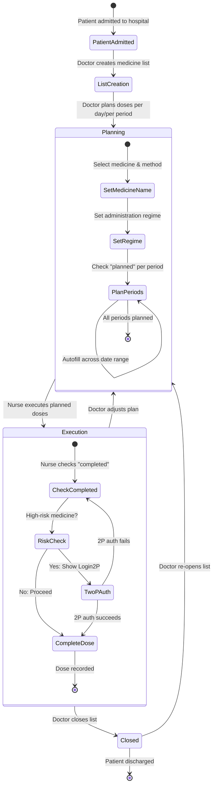
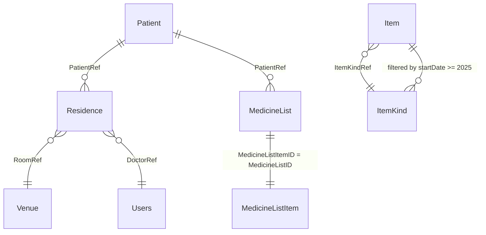
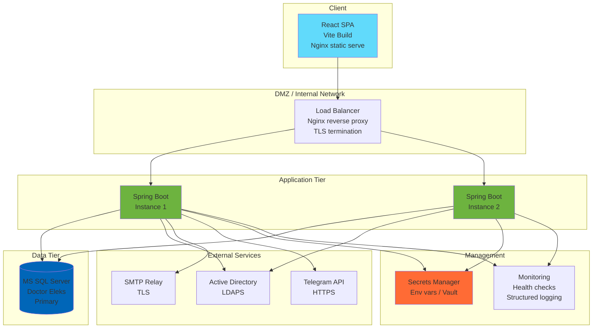

# SPEC-001: Medicine Prescription List System

## Reverse Engineering Analysis
**Date:** 2026-07-25
**Source:** Repository analysis only
**Methodology:** Agentic AI Skill Set — Reverse Engineer Software System

---

## 1. Executive Summary

### System Purpose
A medical prescription list management system for **Superhumans Lviv** medical center. The system enables doctors and nurses to create, edit, approve, and finalize 21-day medicine prescription sheets and vital signs tracking sheets for inpatients. It integrates with Active Directory for enterprise authentication and includes Telegram bot + email notifications.

### Business Domain
**Inpatient hospital medicine administration** — specifically for the reconstructive surgery and rehabilitation departments of Superhumans Lviv, a Ukrainian medical center for war-injured patients.

### Key Capabilities
- **Medicine List Management:** Create, edit, close, copy, and delete prescription lists with 21-day schedules across 4 daily time periods (morning/day/evening/night)
- **Vital Signs Tracking:** Temperature, blood pressure, SpO2, pulse, stool, and pain scale per day per period
- **Enterprise Authentication:** LDAP/Active Directory primary auth with local DB fallback + JWT session tokens
- **Role-Based Access Control:** ADMIN (full system), DOCTOR (plan), NURSE (execute) with granular permissions
- **High-Risk & Conflict Detection:** Color-coded warnings for high-risk medicines and PTG-based drug interaction conflicts
- **Two-Person Verification (2P):** Second person login required for nurses administering high-risk medicines
- **Document Editing Locks:** Optimistic concurrency to prevent concurrent editing
- **Printing:** A4 landscape print of official Ministry of Health form No. 003-4/o
- **Integration:** Doctor Eleks (DE) document generation; Telegram bot notification; Email (Gmail SMTP)
- **Automatic List Creation:** Scheduled task for auto-creating medicine lists for newly admitted patients

### System Scope
Two-tier web application: Spring Boot REST API backend + React SPA frontend. Single MS SQL Server database. No microservices, no caching layer, no message queues.

### High-Level Architecture
```
┌─────────────┐     HTTP/JSON      ┌───────────────────┐
│  React 19   │ ◄────────────────► │  Spring Boot 3.3  │
│  Vite SPA   │    JWT Bearer      │  REST API         │
│             │                    │  (Java 17)        │
└─────────────┘                    └──────┬────────────┘
                                         │ JDBC (JdbcTemplate)
                                    ┌────┴────────────┐
                                    │   MS SQL Server  │
                                    │   (DoctorEleks)  │
                                    └─────────────────┘
                                         
  External Dependencies:
  ┌──────────┐  ┌──────────┐  ┌──────────┐
  │   LDAP   │  │ Telegram │  │  Gmail   │
  │   (AD)   │  │   Bot    │  │   SMTP   │
  └──────────┘  └──────────┘  └──────────┘
```

---

## 2. System Overview

### 2.1 Confirmed

| Fact | Evidence |
|------|----------|
| Spring Boot 3.3.9, Java 17 | `pom.xml:8`, `pom.xml:30` |
| React 19 SPA with Vite 6.2 | `package.json:21,34` |
| MS SQL Server database via JDBC | `pom.xml:67-68`, `application.properties:2-4` |
| JdbcTemplate data access (no ORM) | `pom.xml:35` (`spring-boot-starter-jdbc`), `MedicineListRepository.java` |
| LDAP/Active Directory authentication | `pom.xml:104-111`, `LdapConfig.java`, `application.properties:13-16` |
| JWT token authentication (auth0 library) | `pom.xml:89-91`, `UserAuthenticationProvider.java` |
| Spring Security with role-based access | `SecurityConfig.java` |
| BCrypt password encoding for local users | `PasswordConfig.java` |
| Telegram bot notifications (optional) | `SHMedicineListBot.java`, `telegram.bot.enabled=false` |
| Email notifications (Gmail SMTP) | `EmailServiceImpl.java`, `application.properties:28-33` |
| Doctor Eleks document generation | `generateDeDocument()` in `MedicineListRepository.java` |
| JSON-in-column data storage | `MedicineListRepository.java` serializes/deserializes JSON via Jackson |
| 21-day prescription schedule | `prescriptionlist-back/.../service/impl/MedicineListServiceImpl.java` (21 empty Day records) |
| Two-person verification (2P auth) | `Login2P.jsx`, `AuthProvider.jsx` (`handleLogin2P`) |
| Document editing lock (optimistic concurrency) | `isDocumentEditing()`, `updateMedicineListStatusByListId()` |
| Hardcoded secrets in properties | `application.properties:8,15,25-26,30-31` |
| Ukrainian-language UI | All UI text in Ukrainian, `index.html:7` title |
| Single placeholder unit test | `PrescriptionlistApplicationTests.java` (contextLoads only) |
| No CI/CD definitions | No `.github/workflows/`, no `Jenkinsfile`, no `Dockerfile` |
| No caching infrastructure | No Redis, no `@Cacheable`, no caffeine dependencies |

### 2.2 Inferred

| Inference | Supporting Evidence |
|-----------|-------------------|
| **Intended for internal hospital network** (not internet-facing) | Hardcoded internal IPs (192.168.24.x), no HTTPS configuration, no rate limiting, no API gateway |
| **Low concurrent user count** (single hospital) | No connection pooling beyond Spring Boot default, single database, optimistic locking is manual (status field) |
| **Doctor Eleks is the primary hospital information system** | The system generates documents for DE, queries DE database tables directly (`ItemKind`, `Patient`, `Residence`, `Venue`) — this is an extension/satellite to Doctor Eleks |
| **`v.yamnyi` is a superuser** | Hardcoded check in `PatientDetails.jsx` and `List.jsx` bypasses normal doctor restrictions for this user |
| **State persistence is incomplete** | `localStorage` used extensively for patient data, user info, display prefs — may cause stale data between sessions |
| **Auto-create medicine list is currently disabled** | `@Scheduled` annotation on `autoCreateNewMedicineList()` is commented out |

---

## 3. Domain Model

### 3.1 Entity Catalog

#### Core Medical Entities

| Entity | Source Files | Type | Description |
|--------|-------------|------|-------------|
| **MedicineList** | `MedicineList.java` | Root Aggregate | Complete prescription document for one patient |
| **MedicineDetails** | `MedicineDetails.java` | Entity | One medicine row in the list (name, method, regime, 21-day schedule) |
| **Day** | `Day.java` | Value Object | One calendar day containing 4 time periods |
| **DayPart** | `DayPart.java` | Value Object | Single time period (morning/day/evening/night) with dose, planned/completed flags, signatures |
| **VitalList** | `VitalList.java` | Value Object | Wrapper for vital signs tracking |
| **VitalListDay** | `VitalListDay.java` | Value Object | One day of vital signs (morning + evening) |
| **VitalListDayPart** | `VitalListDayPart.java` | Value Object | Vital measurements for one time period |
| **Medicine** | `Medicine.java` | Reference | Catalog medicine (from ItemKind table) |
| **Allergies** | `Allergies.java` | Value Object | Patient allergies parsed from XML |

#### Patient & User Entities

| Entity | Source Files | Type | Description |
|--------|-------------|------|-------------|
| **Patient** | `Patient.java` | Entity | Inpatient with demographics, room/bed, attending doctor |
| **IdsAndDateTimes** | `IdsAndDateTimes.java` | Value Object | Links patient ID with edit timestamp |
| **User** | `User.java` | Entity (UserDetails) | Local DB user with JWT token, role, business role |
| **SignUp** | `SignUp.java` | DTO (record) | Registration/update request data |
| **Credentials** | `Credentials.java` | DTO (record) | Login credentials |
| **Role** | `Role.java` | Enum | USER / ADMIN / EMPLOYEE with permission sets |
| **Permission** | `Permission.java` | Enum | 8 granular permissions (admin:read, employee:create, etc.) |
| **LdapUserDetailsAdapter** | `LdapUserDetailsAdapter.java` | Adapter | Maps AD attributes to Spring Security UserDetails |
| **Error** | `Error.java` | DTO (record) | Error message wrapper |
| **Payload** | `Payload.java` | DTO (typed) | Composite request body (medicineList + patient + page) |

### 3.2 Mermaid Entity-Relationship Diagram

```mermaid
erDiagram
    Patient ||--o{ MedicineList : "patientRef"
    MedicineList ||--o{ MedicineDetails : "medicineDetails (JSON)"
    MedicineDetails ||--o{ Day : "medicineDetails list"
    Day ||--|| DayPart : "morning"
    Day ||--|| DayPart : "day"
    Day ||--|| DayPart : "evening"
    Day ||--|| DayPart : "night"
    MedicineList ||--|| VitalList : "vitalList (JSON)"
    VitalList ||--o{ VitalListDay : "vitalList"
    VitalListDay ||--|| VitalListDayPart : "morning"
    VitalListDay ||--|| VitalListDayPart : "evening"
    Medicine ||--o{ MedicineDetails : "medicineName reference"
    Patient ||--o{ Allergies : "patient ID"
    User }o--|| Role : "userRole"
    Role ||--o{ Permission : "permissions"
    User }o--o{ MedicineList : "creationUser / editUser"

    Patient {
        int id PK
        string name
        string historyNumber
        string address
        string phone
        string department
        string roomNumber
        string bedNumber
        string gender
        int age
        string birthDate
        string doctor
        string doctorUserName
        string residenceStatus
        list editDates
    }

    MedicineList {
        int medicineListID PK
        int patientRef FK
        string documentName
        string creationUser
        datetime creationDate
        string status
        json medicineDetails
        json vitalList
        list approvedRowIndexes
    }

    MedicineDetails {
        string medicineListItemId UUID
        string editUser
        string medicineMethod
        string regime
        string medicineName
        datetime editDate
        string status
        list days
    }

    Day {
        string id UUID
        string date ISO
        object morning DayPart
        object day DayPart
        object evening DayPart
        object night DayPart
    }

    DayPart {
        string id UUID
        string time
        string medicineDose
        string pain
        bool isPlanned
        bool isPlannedAndFinished
        bool isCompleted
        bool isCompletedAndFinished
        string doctorName
        string nurseName
    }

    User {
        int id PK
        string firstName
        string lastName
        string middleName
        string login
        string password BCrypt
        string token JWT
        enum userRole
        string businessRole
    }

    Role {
        enum USER
        enum ADMIN
        enum EMPLOYEE
    }

    Permission {
        string admin_read
        string admin_update
        string admin_create
        string admin_delete
        string employee_read
        string employee_update
        string employee_create
        string employee_delete
    }
```

### 3.3 Entity Lifecycle & Business Rules

#### MedicineList Lifecycle
```
[Created] ──► [Being Edited] ──► [Saved] ──► [Editing] ──► ... ──► [Finished]
                                     │                                   │
                                     ▲───────────────────────────────────┘
                                     (re-open by clicking "Edit")

Status values stored in the `MedicineList.status` DB column:
- "Saved" — document is not actively being edited
- User's login (e.g. "v.yamnyi") — document is locked for editing by this user
- "Finished" — document is closed/finalized; no further edits allowed
```

#### DayPart State Transitions (per period)
```
                DOCTOR left-click          DOCTOR middle-click
[empty] ─────────────────────────► [isPlanned] ──────────────────────► [isPlannedAndFinished]
  │                                    │                                      │
  │ NURSE left-click                   │ NURSE middle-click                   │
  ▼                                    ▼                                      ▼
[isCompleted] ◄──────────────── [isPlanned]                             [locked]
  │                               + isCompleted
  │ NURSE middle-click
  ▼
[isCompletedAndFinished]
```

#### Validation Rules
- **Login uniqueness:** Duplicate login throws AppException (400 Bad Request)
- **Document status before edit:** If status is "Finished" or another user's login, throws AppException (409 Conflict)
- **High-risk medicine check:** Medicine category 13 or 14 in ItemKind = high risk; 2P auth required for nurse execution
- **Conflict medicine check:** Same PTG codes in overlapping groups (1-2, 1-2,3, 2,3-4, 3-4, 5-6) = conflict
- **Allergy check:** Selected medicine name matched against patient allergies; blocks selection with alert
- **Password confirmation:** Registration requires password == password_confirm
- **Doctor assignment restriction:** Only assigned doctor (or v.yamnyi) can create new medicine lists for a patient

---

## 4. Functional Architecture

### 4.1 Module Decomposition

| Module | Package/Path | Responsibility |
|--------|-------------|----------------|
| **Auth Controller** | `controller/AuthController.java` | Login, 2P login, user CRUD (admin) |
| **Medicine List Controller** | `controller/MedicineListController.java` | All medicine list + patient + medicine catalog operations |
| **User Service** | `service/UserService.java`, `impl/UserServiceImpl.java` | LDAP auth, user CRUD, Spring Security UserDetailsService |
| **Medicine Service** | `service/MedicineService.java`, `impl/MedicineListServiceImpl.java` | Medicine list business logic, auto-creation, notifications |
| **Email Service** | `service/EmailService.java`, `impl/EmailServiceImpl.java` | HTML email sending via JavaMail |
| **Medicine List Repository** | `repository/MedicineListRepository.java` | All DB queries for medicine lists, patients, medicines, allergies, Telegram |
| **User Repository** | `repository/UserRepository.java` | SH_Users table CRUD |
| **Security Config** | `config/SecurityConfig.java` | Spring Security filter chain, role-based authorization, CORS |
| **JWT Provider** | `config/UserAuthenticationProvider.java` | JWT creation, validation (lightweight GET, strong non-GET) |
| **JWT Filter** | `config/JwtAuthFilter.java` | Intercepts all HTTP requests, validates JWT, sets SecurityContext |
| **LDAP Config** | `config/LdapConfig.java` | Active Directory connection and authentication provider setup |
| **Telegram Bot** | `config/SHMedicineListBot.java` | Telegram notification bot with subscriber management |
| **Rest Exception Handler** | `config/RestExceptionHandler.java` | Global `@ControllerAdvice` for structured error responses |
| **AD Context Mapper** | `utils/ADUserContextMapper.java` | Maps AD attributes to application UserDetails |
| **JSON Compressor** | `utils/JsonCompressor.java` | GZIP compress/decompress JSON (available but unused in live code) |
| **Frontend Auth Provider** | `component/auth/AuthProvider.jsx` | React context for auth state, login/logout, 2P auth |
| **Frontend API Client** | `utils/ApiFunctions.js` | Axios instance with JWT interceptor, all API functions |
| **Frontend Business Logic** | `utils/Functions.js` | Medicine list mutations, date handling, form management (752 lines) |
| **List Editor** | `component/MedicineList/List.jsx` | Core grid editor (1838 lines) — the most complex component |
| **Vital List Editor** | `component/MedicineList/VitalList.jsx` | Vital signs grid editor (522 lines) |
| **Home Dashboard** | `component/Home.jsx` | Patient list, sorting, search, department switching, daily print (698 lines) |
| **Patient Details** | `component/MedicineList/PatientDetails.jsx` | Patient profile, document list, scaled previews |
| **Print Components** | `ListPrint.jsx`, `ListPrintWrapper.jsx`, `MedicineListPrint.jsx` | A4 printed forms |

### 4.2 Key Capability Details

#### Authentication & Authorization
**Inputs:** Login credentials (username + password)
**Execution Logic:**
1. User submits credentials to `/api/auth/login`
2. Backend attempts LDAP authentication first (`LdapAuthService.authenticate()`)
3. If LDAP succeeds, user info extracted from AD (`givenName`, `sn`, `mail`)
4. Local DB lookup by login; if not found, auto-creates user with EMPLOYEE role and password "LDAP" (marker)
5. If LDAP fails, throws `AppException("Invalid AD credentials", 401)`
6. JWT created with claims: `sub`(login), `firstName`, `lastName`, `businessRole`, `userRole`
7. Token returned; frontend stores in localStorage, decodes with `jwt-decode`
8. Subsequent requests include `Authorization: Bearer <token>` header
9. `JwtAuthFilter` validates: GET requests use lightweight claims-only validation; POST/PUT/DELETE verify user exists in DB
**Outputs:** JWT token, User object (password cleared)
**Dependencies:** LDAP server (192.168.24.5:389), SH_Users table, BCrypt encoder
**Failure Behavior:** 401 Unauthorized with JSON `{"message":"Invalid AD credentials"}`

#### Medicine List CRUD
**Inputs:** Payload (medicineList + patient + medicineListPage), document ID, patient ID
**Execution Logic:**
1. Frontend builds MedicineList object with 21 empty Day records (each with UUID IDs, 4 DayParts)
2. JSON-serialized via Jackson ObjectMapper
3. Backend inserts into `MedicineList` and `MedicineListItem` tables
4. On update: checks status for concurrency; serializes `MedicineDetails`, `VitalList`, `ApprovedRowIndexes` to JSON
5. Telegram notification sent after create/update
6. Email notification prepared for cross-doctor updates (commented out)
**Outputs:** Created/updated document, 201/200 status
**Dependencies:** MedicineListRepository, SHMedicineListBot, EmailService
**Edge Cases:** Copy mode resets all planned/completed flags; autofill copies template across date range; max 90 days; 12 medicines per page for printing

#### Two-Person Verification (2P)
**Inputs:** Second person's login credentials
**Execution Logic:**
1. Nurse clicks "Completed" checkbox on high-risk medicine (category 13 or 14)
2. Frontend stores pending action (checkbox toggle) and shows Login2P overlay
3. Second person (doctor or another nurse) enters credentials
4. On success, second person's JWT stored with "2P" suffix in localStorage
5. Pending action executes; validates `sub != sub2P` (second person must be different)
6. Nurse name recorded as both persons combined
**Dependencies:** AuthProvider.handleLogin2P(), Login2P component
**Failure Behavior:** 2P login failure keeps pending action unexecuted

#### High-Risk & Conflict Detection
**Inputs:** Medicine name string
**Execution Logic:**
1. All medicine names on a list are sent to `getHighRiskMedicineByName()` (checks ItemKindMedicineCategoryRef IN (13, 14))
2. All medicine names sent to `getConflictMedicineByName()` (checks ItemKindPTG IN ('1','2','3','4','5','6','2,3'))
3. Frontend computes conflict pairs based on PTG group compatibility matrix
4. High-risk rows get pink (#FFCCCB) background; conflict rows get yellow (#ffe680) with blink animation
**Dependencies:** ItemKind table in DoctorEleks DB

#### Printing
**Inputs:** Medicine list data, selected date
**Execution Logic:**
1. Medicine details chunked into 7-day groups, then paginated at 12 medicines per page
2. Renders official Ministry of Health Ukraine form No. 003-4/o header
3. Grid: 7 columns (days) x 4 periods x 12 medicine rows
4. Shows planned/completed check marks, doctor/nurse signatures
5. React-to-print via `useReactToPrint` hook with A4 landscape CSS
**Outputs:** Printable HTML pages
**Dependencies:** `react-to-print` library, `listprint.css`

#### Document Editing Lock
**Inputs:** Document ID
**Execution Logic:**
1. On document open: `updateMedicineListStatusByListId(id, currentUserLogin)` — sets status to user's login
2. On document load: `isDocumentEditing(id)` — checks if status == "Finished" or another user's login
3. If blocked: returns 409 Conflict; frontend sets ROLE to "BLOCKED_DOCTOR" or "BLOCKED_NURSE" (read-only)
4. On document close/navigate away: `updateMedicineListStatusByListId(id, "Saved")` via cleanup effect and `beforeunload` / `popstate` listeners
**Failure Behavior:** 409 Conflict with `AppException("Currently list editing by USER", HttpStatus.CONFLICT)`

---

## 5. Workflow / Business Process Analysis

### 5.1 Main Workflow: Inpatient Prescription



### 5.2 Decision Points

| Decision | Condition | Path A | Path B |
|----------|-----------|--------|--------|
| Medicine is high-risk? | `ItemKindMedicineCategoryRef` IN (13,14) | Show pink bg, require 2P for nurse | Normal behavior |
| Medicine conflicts? | Same PTG in incompatible groups | Show yellow bg + blink | Normal behavior |
| Medicine is patient allergy? | Name match in allergies list | Alert + block selection | Allow selection |
| Another user editing? | Status != "Saved" AND status != currentUser | 409 Conflict, read-only mode | Allow editing |
| Document exists for patient? | Query returns document | Show "Edit" button | Show "Create" button |
| Current user is assigned doctor? | `doctorUserName == sub` OR `v.yamnyi` | Can create new list | Show only if no existing list |

### 5.3 Recovery Paths
- **Document lock release:** `beforeunload` + `popstate` listeners call `updateMedicineListStatusByListId(id, "Saved")` on close
- **Inactivity timeout:** 5-minute timer in List.jsx redirects to patient details
- **401 handling:** Axios interceptor redirects to `/login` when token missing/expired
- **Token expiration:** `isTokenExpired()` check in interceptor; 86400s (24h) for access tokens, 604800s (7d) for refresh tokens

---

## 6. Source Code Architecture

### 6.1 Backend (Spring Boot — prescriptionlist-back)

#### Entry Point
**`PrescriptionlistApplication.java`** — Spring Boot main class with `@EnableScheduling` and explicit `@ComponentScan` restricted to `controller`, `service`, `repository`, `config` packages. The `exception`, `utils`, and `model` packages are implicitly available via import but not component-scanned.

#### Controller Layer
| File | Key Class | Lines | Purpose |
|------|-----------|-------|---------|
| `AuthController.java` | `AuthController` | ~60 | 6 endpoints: login, login2P, register, get users, update user, delete user |
| `MedicineListController.java` | `MedicineListController` | ~200 | 16 endpoints for medicine lists, patients, medicine catalog, document generation |

#### Service Layer
| File | Key Class | Lines | Purpose |
|------|-----------|-------|---------|
| `MedicineListServiceImpl.java` | `MedicineListServiceImpl` | 294 | Core business logic, auto-create 21-day schedules, notification dispatch |
| `UserServiceImpl.java` | `UserServiceImpl` | 129 | LDAP-first auth, auto-create local user, user CRUD |
| `EmailServiceImpl.java` | `EmailServiceImpl` | ~30 | MIME HTML email via JavaMailSender |
| `LdapAuthService.java` | `LdapAuthService` | ~20 | LDAP authentication wrapper |
| `UserSecurityDetails.java` | `UserSecurityDetails` | ~30 | UserDetails adapter for local DB users |

#### Repository Layer
| File | Key Class | Lines | Purpose |
|------|-----------|-------|---------|
| `MedicineListRepository.java` | `MedicineListRepository` | 643 | **Largest file.** All medicine list, patient, medicine, allergy, Telegram DB operations via JdbcTemplate |
| `UserRepository.java` | `UserRepository` | 127 | SH_Users table CRUD |

#### Config Layer (11 files)
| File | Purpose |
|------|---------|
| `SecurityConfig.java` | HTTP security: JWT filter, stateless sessions, role-based URL patterns |
| `JwtAuthFilter.java` | Per-request JWT validation (lightweight for GET, strong for mutations) |
| `UserAuthenticationProvider.java` | JWT creation with HMAC256, dual validation methods |
| `AuthManagerConfig.java` | Wires DAO + LDAP providers into single AuthenticationManager |
| `LdapConfig.java` | AD connection: `sAMAccountName` search, BindAuthenticator, user context mapping |
| `PasswordConfig.java` | BCryptPasswordEncoder bean |
| `UserAuthenticationEntryPoint.java` | 401 JSON response on auth failure |
| `WebConfig.java` | CORS: localhost:5173 and 192.168.24.32:5173 |
| `RestExceptionHandler.java` | `@ControllerAdvice` for AppException |
| `SHMedicineListBot.java` | Telegram LongPollingBot with subscriber persistence |
| `Config.java` | Jackson ObjectMapper config + conditional Telegram bot registration |

#### Model Layer
- **medicinelist/**: `MedicineList`, `MedicineDetails`, `Day`, `DayPart`, `VitalList`, `VitalListDay`, `VitalListDayPart`, `Medicine`, `Allergies`
- **patient/**: `Patient`, `IdsAndDateTimes`
- **user/**: `User`, `Credentials`, `SignUp`, `Role`, `Permission`, `LdapUserDetailsAdapter`, `Error`
- **payload/**: `Payload`

#### Key Design Patterns
- **JSON-in-column:** MedicineList stores `MedicineDetails`, `VitalList`, and `ApprovedRowIndexes` as JSON strings in `MedicineListItem` table columns — effectively a document store pattern on top of relational DB
- **Manual concurrency control:** Status column used as editing lock; checked and updated in application code (no `SELECT FOR UPDATE` or `@@version` field)
- **Static security context access:** `MedicineListRepository.getCurrentLogin()` extracts user from SecurityContext statically — coupling data access to security context
- **ComponentScan restriction:** Only 4 packages scanned; models are used via import rather than annotation scanning

### 6.2 Frontend (React 19 — sh-medicine-prescription-list)

#### Component Hierarchy
```
<BrowserRouter>
  <AuthProvider>
    <App>
      <Main>
        Login | Login2P | Registration | _403 | Admin
        <RequireAuth> ── Home | ListDetails | NewList | PatientDetails | ListPrint | MedicineListPrint
```

#### Key Component Details

| Component | Lines | Props | Key Responsibilities |
|-----------|-------|-------|---------------------|
| **List.jsx** | 1838 | 30+ | Core grid editor: 21-day x 4-period medicine schedule, 2P auth, autofill, conflict detection |
| **Home.jsx** | 698 | URL params | Patient dashboard: department switching, sorting, search, daily print, status highlighting |
| **VitalList.jsx** | 522 | 30+ | Vital signs grid: temp, BP, SpO2, pulse, stool, pain per period |
| **ListPrint.jsx** | 478 | allPages, user | Official form No. 003-4/o A4 print render |
| **PatientDetails.jsx** | 331 | none (uses URL) | Patient profile, document list, scaled preview, create/edit/delete |
| **ListDetails.jsx** | ~250 | isCopy, isScaled, Id | Document loader: fetch, save, copy, editing lock management |
| **NewList.jsx** | ~150 | none (uses URL) | New document creator: routes to List or VitalList |
| **AuthProvider.jsx** | ~80 | children | Auth context: login, login2P, logout, localStorage management |
| **Functions.js** | 752 | N/A (utility) | 26 exported functions: date math, medicine list mutations, form handling |

#### State Management Pattern
**No state library (Redux/MobX/Context).** Pure prop drilling with `useState`:
```
Parent (NewList/ListDetails) holds master state:
  medicineList, medicineDetails, vitalList, triggerSubmit
   │
   ├── Passes state + setters as props ──► List.jsx (30+ props)
   │                                          ├── Internal state: dateRange, inputValues, highRiskMap, ...
   │                                          └── Renders: grid cells, modals, search dropdown
   │
   └── Passes state + setters as props ──► VitalList.jsx (30+ props)
                                              └── Internal state: dateRange
```

#### localStorage Usage
| Key | Purpose |
|-----|---------|
| `accessToken` | Primary JWT |
| `accessToken2P` | Second person JWT |
| `sub`, `firstName`, `lastName`, `businessRole`, `userRole` | Primary user info |
| `sub2P`, `firstName2P`, `lastName2P`, `businessRole2P`, `userRole2P` | Second person info |
| `patient` | Cached patient JSON |
| `selectedRowIndex` | Persisted row selection |

#### Shared Logic (Functions.js — 26 exports)
| Category | Functions |
|----------|-----------|
| **Date handling** | `getWeekDates`, `formatDate`, `formatDate2`, `formatDateToISO`, `isoToTimestampSeconds`, `isLessThanOneHour`, `isEmpty`, `refreshDates` |
| **Medicine list mutation** | `handleAddNewDayDetails`, `handleAddNewMedicineItem`, `handleAddNewMedicineItem2`, `handleRemoveMedicineItem`, `handleApproveMedicine`, `handleAutofill`, `handleDelNewDayDetails` |
| **Vital list mutation** | `handleAddNewVitalList`, `handleVitalChange` |
| **Form handling** | `handleDetailChange`, `handleSubmit`, `handleMedicineMethodChange`, `handleMedicineRegimeChange` |
| **Search** | `handleSearchedMedicineClick`, `handleCurrentRowClick` |
| **Auth** | `isTokenExpired` |

---

## 7. Data Layer Analysis

### 7.1 Storage Systems

| System | Type | Connection | Purpose |
|--------|------|------------|---------|
| **MS SQL Server** | Relational DB | `jdbc:sqlserver://192.168.24.10;databaseName=DoctorEleks` | Primary data store — this is the Doctor Eleks HIS database |
| **File system** | Log files | `logs/app.log` | Application logging |
| **localStorage** | Browser storage | Client-side only | Session cache, user preferences, patient data |

### 7.2 Schema Reconstruction (Confirmed Tables)

The system queries an existing **Doctor Eleks** database. The following tables are accessed:

#### Application Table
**`SH_Users`** (local application users — NOT part of Doctor Eleks)
| Column | Type | Notes |
|--------|------|-------|
| `SH_UserId` | INT (PK, auto) | User identity |
| `firstName` | VARCHAR | |
| `lastName` | VARCHAR | |
| `login` | VARCHAR | Unique login |
| `password` | VARCHAR | BCrypt hash |
| `user_role` | VARCHAR | "ADMIN" / "EMPLOYEE" / "USER" |
| `business_role` | VARCHAR | "DOCTOR" / "NURSE" |

#### Medicine List Tables (App-specific — possibly in DoctorEleks DB)
**`MedicineList`**
| Column | Type | Notes |
|--------|------|-------|
| `MedicineListID` | INT (PK) | Auto-generated |
| `PatientRef` | INT (FK → Patient) | |
| `DocumentName` | VARCHAR | e.g. "Листок лікарських призначень (стаціонар)" |
| `MedicineListCreationUser` | VARCHAR | Login of creator |
| `MedicineListCreationDate` | DATETIME | |
| `Status` | VARCHAR | User login or "Saved" or "Finished" |

**`MedicineListItem`** (child of MedicineList)
| Column | Type | Notes |
|--------|------|-------|
| `MedicineListItemID` | INT (FK → MedicineList) | |
| `MedicineDetails` | VARCHAR(MAX) / JSON | Serialized MedicineDetails array |
| `ApprovedRowIndexes` | VARCHAR(MAX) / JSON | TreeSet<Integer> as JSON array |
| `VitalList` | VARCHAR(MAX) / JSON | Serialized VitalList object |
| `MakeDEDocument` | ? | Flag for document generation trigger |

#### Doctor Eleks Tables (read/write, shared)
**`Patient`**
| Column | Type | Notes |
|--------|------|-------|
| `PatientId` | INT (PK) | |
| `PatientName` | VARCHAR | |
| `PatientBirthDate` | DATETIME | |
| `PatientHistoryNumber` | VARCHAR | |
| `PatientAddress` | VARCHAR | |
| `PatientPhone` | VARCHAR | |
| `PatientGender` | VARCHAR | Code (e.g. "MAL") — mapped to Ukrainian |
| `PatientAge` | INT | |

**`Residence`** (hospital stay records)
| Column | Type | Notes |
|--------|------|-------|
| `ResidenceID` | INT (PK) | |
| `PatientRef` | INT (FK → Patient) | |
| `ResidenceType` | INT | 19 = Surgery, 37 = Rehabilitation |
| `RoomRef` | INT (FK → Venue) | |
| `DoctorRef` | INT (FK → Users) | Attending doctor |
| `ResidenceStatus` | VARCHAR | e.g. "PRG" (in progress) |
| `ResidenceStartDateTime` | DATETIME | |
| `ResidenceEndDateTime` | DATETIME | |

**`Venue`** (room/bed hierarchy)
| Column | Type | Notes |
|--------|------|-------|
| `VenueID` | INT (PK) | |
| `VenueType` | VARCHAR | Room or Bed |
| `VenueParentRef` | INT (FK → Venue) | Parent venue (bed → room) |
| `VenueName` | VARCHAR | Room/bed number |

**`Item`** (medicine stock/catalog)
| Column | Type | Notes |
|--------|------|-------|
| `ItemID` | INT (PK) | |
| `ItemKindRef` | INT (FK → ItemKind) | |
| `ItemStartDate` | DATETIME | |
| `LeftQuantity` | DECIMAL | |

**`ItemKind`** (medicine definitions)
| Column | Type | Notes |
|--------|------|-------|
| `ItemKindID` | INT (PK) | |
| `ItemKindName` | VARCHAR | Medicine name |
| `ItemKindMedicineCategoryRef` | INT | 13/14 = high risk |
| `ItemKindPTG` | VARCHAR | Pharmacotherapeutic group code |

**`Document` / `DocumentNode`** (medical records)
- Used for allergy extraction via specific template GUIDs
- Templates 23 and 166 for allergy data
- XML content parsed for `<dictInfo>` → `<Name>` values

**`Users`** (Doctor Eleks users)
| Column | Type | Notes |
|--------|------|-------|
| `UserID` | INT (PK) | |
| `UserFirstName` | VARCHAR | |
| `UserLastName` | VARCHAR | |

**`ChatIds`** (Telegram subscriptions — app-specific)
| Column | Type | Notes |
|--------|------|-------|
| `ChatId` | BIGINT (PK) | Telegram chat ID |

### 7.3 Data Relationships



### 7.4 Data Lifecycle
- **MedicineList creation:** INSERT into MedicineList → INSERT into MedicineListItem with JSON
- **MedicineList update:** UPDATE MedicineListItem SET MedicineDetails/VitalList/ApprovedRowIndexes
- **MedicineList deletion:** DELETE MedicineListItem → DELETE MedicineList (cascade in app code)
- **User registration:** INSERT SH_Users with BCrypt password → SELECT to get generated ID
- **Telegram subscription:** User sends /start → chat ID saved to ChatIds table
- **No archival or soft-delete strategy observed**

### 7.5 Constraints
- Login uniqueness enforced in application code (CHECK before INSERT in `UserRepository.save()`)
- No foreign key constraints confirmed at DB level — referential integrity managed in application
- JSON columns have no schema enforcement (schema-on-read pattern)

---

## 8. API Analysis

### 8.1 Base URL
`http://192.168.24.32:8080` (hardcoded in `ApiFunctions.js`)

### 8.2 Authentication Endpoints

| Method | Route | Auth | Purpose |
|--------|-------|------|---------|
| `POST` | `/api/auth/login` | None | LDAP auth + JWT creation |
| `POST` | `/api/auth/login/2P` | None | Identical to login (separate endpoint for 2P) |
| `POST` | `/api/auth/admin/register` | `admin:create` | Register new user |
| `GET` | `/api/auth/admin` | `admin:read` | List all users |
| `PUT` | `/api/auth/admin` | `admin:update` | Update user |
| `DELETE` | `/api/auth/admin/{id}` | `admin:delete` | Delete user |

#### POST /api/auth/login
**Request:** `{ "login": "string", "password": "string" }`  
**Success (200):** `{ "id": int, "firstName": "string", "lastName": "string", "login": "string", "token": "string", "userRole": "string", "businessRole": "string" }`  
**Error (401):** `{ "message": "Invalid AD credentials" }`  
**Security:** No rate limiting observed. Password in plaintext over HTTP (no HTTPS configured).

### 8.3 Medicine List Endpoints

| Method | Route | Required Authority | Purpose |
|--------|-------|-------------------|---------|
| `GET` | `/api/medicinelist` | `employee:read` or `admin:read` | All medicine lists |
| `GET` | `/api/medicinelist/bylist/{id}` | Same | Single list by ID |
| `GET` | `/api/medicinelist/bypatient/{id}` | Same | All documents for a patient |
| `GET` | `/api/medicinelist/allergies/bypatient/{id}` | Same | Patient allergies |
| `POST` | `/api/medicinelist` | `employee:create` or `admin:create` | Create new list |
| `PUT` | `/api/medicinelist` | `employee:update` or `admin:update` | Update existing list |
| `PUT` | `/api/medicinelist/{id}?status=` | Same | Update list status (editing lock) |
| `PUT` | `/api/medicinelist/closelist/{id}` | Same | Close/finalize list |
| `DELETE` | `/api/medicinelist/{id}` | `employee:delete` or `admin:delete` | Delete list |
| `GET` | `/api/medicinelist/searchpatients?keyword=` | `employee:read` or `admin:read` | Search patients |
| `GET` | `/api/medicinelist/searchmedicine?keyword=` | Same | Search medicine catalog |
| `GET` | `/api/medicinelist/medicine/getHighRiskMedicineByName?highRiskMedicineName=` | Same | High-risk check |
| `GET` | `/api/medicinelist/medicine/getConflictMedicineByName?conflictMedicineName=` | Same | Conflict check |
| `GET` | `/api/medicinelist/patient/{id}` | Same | Patient by ID |
| `GET` | `/api/medicinelist/patient/sort?order=&residence=` | Same | Sorted inpatient list |
| `GET` | `/api/medicinelist/isDocumentEditing/{id}` | Same | Check editing status |
| `GET` | `/api/medicinelist/generatedoc?medicineListID=&documentDateTime=` | Same | Generate DE document |

#### POST /api/medicinelist
**Request:** `{ "medicineList": { ... }, "patient": { ... } }`  
**Success (201):** Created medicine list object  
**Error (400):** Duplicate or invalid data

#### PUT /api/medicinelist
**Request:** `{ "medicineList": { ... }, "patient": { ... }, "medicineListPage": "string" }`  
**Success (200):** Updated medicine list  
**Error (409):** `{ "message": "Currently list editing by USER" }` — concurrency conflict

### 8.4 Response Format
All errors follow: `{ "message": "string" }` via `Error` record. HTTP status codes: 200, 201, 400, 401, 403, 409.

### 8.5 Authentication Mechanism
- JWT Bearer token in `Authorization` header
- 24-hour access token expiration (86400000ms)
- GET requests use lightweight validation (claims only)
- Non-GET requests use strong validation (DB user check)
- No refresh token endpoint exposed via REST

---

## 9. State Management & Execution Model

### 9.1 State Ownership

| State | Owner | Persistence |
|-------|-------|-------------|
| User identity/JWT | Browser localStorage + AuthProvider context | Survives page refresh |
| Medicine list data | React useState (NewList/ListDetails) | Synced to server on save |
| Editing lock status | DB `MedicineList.Status` column | Server-side, released on close |
| Telegram subscribers | `ChatIds` DB table | Persistent |
| Patient data | localStorage + useState | Cached; fetched on mount |
| UI state (sort order, search terms, selections) | React useState | Lost on refresh |

### 9.2 Event Flows

```
User Action            Frontend                    Backend                 DB
─────────────────────────────────────────────────────────────────────────────────
Open document    ──►   updateStatus(id, sub)  ──► UPDATE Status      ──► status = sub
                       fetch list data        ──► GET /bylist/{id}   ──► SELECT + JSON deserialize
                       
Edit cell        ──►   handleDetailChange()   ──► (local state only)
                       setMedicineListItem()
                       
Save             ──►   handleSubmit()         ──► PUT /medicinelist   ──► UPDATE MedicineListItem
                       show SuccessModal                                    (serialize JSON)
                                                                      ──► (optional) SET MakeDEDocument
                       
Close document   ──►   updateStatus(id,Saved) ──► UPDATE Status      ──► status = "Saved"
                       navigate away

Navigate away    ──►   cleanup (useEffect)    ──► updateStatus         (release lock)
                       beforeunload listener
                       
Nurse completes  ──►   handleDetailChange()
high-risk dose        risk check → Login2P    ──► POST /auth/login/2P (second auth)
                       execute pending change
```

### 9.3 Execution Triggers
- **Scheduled:** `@EnableScheduling` present, but `@Scheduled` on `autoCreateNewMedicineList()` is commented out — no active scheduled tasks
- **Event-driven:** Manual only — all operations triggered by HTTP requests
- **Telegram:** `onUpdateReceived()` fires on Telegram bot message; sends quick reply

### 9.4 Concurrency Behavior
- **Document editing:** Application-level lock via Status column — no database-level locking (`SELECT FOR UPDATE`, `@@version`, `WITH (UPDLOCK)`)
- **Token validation:** Stateless JWT — no server-side session or token blacklist
- **No observable synchronization primitives** (no `synchronized`, `ReentrantLock`, `@Transactional` with isolation levels)

---

## 10. Integration Analysis

### 10.1 External Integration Inventory

| Integration | Type | Protocol | Config | Purpose |
|-------------|------|----------|--------|---------|
| **Active Directory (LDAP)** | Auth provider | LDAP://389 | `192.168.24.5` | Primary user authentication |
| **Doctor Eleks HIS** | Shared database | JDBC (SQL Server) | Same DB instance | Patient data, medicine catalog, document generation |
| **Telegram Bot API** | Notification | HTTPS REST | Bot token, username | Push notifications to subscribed chat IDs |
| **Gmail SMTP** | Email | SMTP:587 (STARTTLS) | App-specific password | HTML email notifications |

### 10.2 Integration Details

#### Active Directory
- **Connection:** `ldap://192.168.24.5:389`, base DN `dc=superhumans,dc=com`
- **Auth flow:** `BindAuthenticator` with `sAMAccountName` search filter
- **Attribute mapping:** `givenName` → firstName, `sn` → lastName, `mail` → email
- **Failure handling:** Falls through to `AppException("Invalid AD credentials", 401)`
- **Security:** Plain LDAP (no LDAPS). Password sent from client to server for bind attempt.

#### Doctor Eleks HIS
- **Integration pattern:** Shared database — reads and writes directly to DE tables
- **Read operations:** Patient, Residence, Venue, ItemKind, Item, Document, DocumentNode, Users
- **Write operations:** MedicineList, MedicineListItem, ChatIds, SH_Users
- **Document generation:** Sets `MakeDEDocument` flag to trigger DE-side document generation
- **Risk:** Tight coupling — any DE schema change breaks the application

#### Telegram Bot
- **Library:** `telegrambots-spring-boot-starter` 6.5.0 (LongPollingBot)
- **Conditional:** Enabled only when `telegram.bot.enabled=true` (currently `false`)
- **Subscriber model:** Users send `/start` to subscribe; bot broadcasts to all subscribers
- **Message content:** "New list created", "List updated", includes patient and doctor info

#### Email (Gmail SMTP)
- **From:** `medicinelistnotifications@superhumans.com`
- **Content:** HTML formatted MIME messages
- **Trigger:** Prepared when non-owner doctor updates a medicine list (approval notification)
- **Status:** Email sending code is **commented out** in `MedicineListServiceImpl.updateMedicineListById()` — prepared but disabled

---

## 11. Testing Strategy Analysis

### 11.1 Existing Tests
**Backend:** 1 test file — `PrescriptionlistApplicationTests.java`
- Single `@SpringBootTest` with `contextLoads()` — verifies application context starts
- **No unit tests** for services, repositories, controllers, or utilities
- **No integration tests** for API endpoints or database operations
- **No security tests** for authentication/authorization

**Frontend:** No test files found. No Jest, Vitest, React Testing Library, or Cypress dependencies in `package.json`.

### 11.2 Coverage Assessment

| Area | Coverage | Risk Level |
|------|----------|------------|
| Auth flow | None | **Critical** — LDAP fallback, JWT validation, role checking untested |
| Medicine list CRUD | None | **High** — 643-line repository with complex JSON serialization |
| Concurrency control | None | **High** — Document editing lock is application-level, no DB guarantees |
| High-risk/conflict detection | None | **High** — Patient safety impact |
| 2P verification | None | **Medium** — Workflow complexity |
| Printing | None | **Low** — Cosmetic output |
| Telegram notifications | None | **Low** — Currently disabled |
| Email sending | None | **Low** — Code is commented out |

### 11.3 Overall Assessment
**"No automated tests found"** (with the exception of one context-load smoke test). The system has effectively zero test coverage. All behavior is validated only in production. This represents the most significant production readiness gap.

---

## 12. Security Analysis

### 12.1 Authentication

| Aspect | Status | Detail |
|--------|--------|--------|
| **LDAP integration** | Present | Primary auth to Active Directory |
| **JWT signing** | Present | HMAC256 with 512-byte secret |
| **Password storage** | Present | BCrypt for local users |
| **Token expiration** | Present | 24h access, 7d refresh |
| **Multi-factor auth** | None | No MFA; 2P auth is application-level, not true MFA |
| **Session management** | Stateless | No server-side session; no token revocation |

### 12.2 Authorization

| Aspect | Status | Detail |
|--------|--------|--------|
| **Role-based access** | Present | ADMIN/EMPLOYEE roles with granular permissions |
| **API-level enforcement** | Present | Spring Security `hasAuthority()` on all endpoints |
| **Document-level auth** | Weak | `v.yamnyi` hardcoded as superuser bypass |
| **Frontend role checks** | Present | But frontend-only checks are trivially bypassed |
| **API consistency** | Good | Backend enforces all rules independently of frontend |

### 12.3 Secrets & Credential Hygiene

**CRITICAL FINDING:** All secrets are hardcoded in `application.properties` committed to the repository:

| Secret Type | Location | Risk |
|-------------|----------|------|
| JWT signing key (512 bytes) | `application.properties:8` | **Critical** — Token forgery possible |
| Database password | `application.properties:4` | **Critical** — Full DB access |
| LDAP bind password | `application.properties:16` | **Critical** — AD access |
| Email password (Gmail) | `application.properties:31` | **High** — Email account compromise |
| Telegram bot token | `application.properties:25` | **Medium** — Bot impersonation |
| LDAP username (email) | `application.properties:15` | **Low** — Username exposure |
| Database username | `application.properties:3` | **Low** — Username exposure |

**No secrets manager, no environment variable substitution, no .env file, no vault integration observed.**

### 12.4 Network Security

| Concern | Status |
|---------|--------|
| **HTTPS** | Not configured — plain HTTP only |
| **CORS** | Configured for localhost:5173 and 192.168.24.32:5173 |
| **CSRF** | Disabled (appropriate for stateless JWT API) |
| **Rate limiting** | None |
| **Request size limits** | None |
| **Input validation** | Spring Validation starter present but minimal `@Valid` usage observed |

### 12.5 Vulnerabilities

| Issue | Location | Severity |
|-------|----------|----------|
| Hardcoded secrets in source | `application.properties` | Critical |
| Plain HTTP (no TLS) | All communication | High |
| No input sanitization on medicine names | `searchMedicine()` | Medium |
| SQL injection via string concatenation | `MedicineListRepository.java` (some queries) | Medium |
| Hardcoded backdoor user | `PatientDetails.jsx` — `v.yamnyi` bypass | Medium |
| No CORS restriction in production | `WebConfig.java` — specific origins but no env-specific config | Low |
| Logging of sensitive data | `logging.level.*=DEBUG` — potential JWT/token logging | Low |

---

## 13. Performance & Scalability Analysis

### 13.1 Performance Characteristics

| Aspect | Assessment |
|--------|------------|
| **Database queries** | Raw JDBC with string concatenation — no prepared statement pooling beyond driver default |
| **JSON serialization** | Full medicine list serialized/deserialized per save/load — grows linearly with days and medicines |
| **Frontend rendering** | 1838-line List.jsx with inline re-renders via useState — no memoization, virtualization, or lazy loading |
| **Network** | Full document sent on every save (not delta/partial update) |
| **Caching** | None — every page load fetches fresh data |
| **Connection pooling** | HikariCP (Spring Boot default) — adequate for single-hospital scale |

### 13.2 Bottlenecks

| Bottleneck | Impact |
|------------|--------|
| JSON-in-column pattern | Large documents (50+ medicines x 90 days) produce large JSON payloads; full rewrite on every save |
| No pagination on list endpoints | `getAllMedicineLists()` returns all records |
| Client-side processing | 21-day grid with potential 50+ medicines = 1050+ cells; no virtualization |
| 1-minute new list initialization | `NewList.jsx` has `setTimeout(..., 1000)` before initializing vital list |
| Document editing lock | No timeout — stale locks persist until browser close event fires |

### 13.3 Scalability Limitations
- **Designed for single hospital** — hardcoded IPs, single database, no horizontal scaling support
- **Stateless API** — would support multiple instances behind a load balancer (minus the document editing lock which is DB-status-based and could race)
- **Estimated user base:** ~20–50 concurrent users (doctors + nurses in one hospital)
- **Maximum practical scale:** Single hospital instance without architectural changes

---

## 14. Code Quality Assessment

| Issue | Impact | Location | Recommendation | Severity |
|-------|--------|----------|----------------|-----------|
| **Hardcoded secrets** | Production compromise | `application.properties` | Externalize via env vars/Spring Cloud Config/Vault | Critical |
| **No test coverage** | Regression risk everywhere | Entire codebase | Add unit tests for services, integration tests for APIs | Critical |
| **Gigantic components** | Maintainability nightmare | `List.jsx` (1838 lines), `Home.jsx` (698 lines) | Decompose into smaller focused components | High |
| **Prop drilling 30+ props** | Brittle component API | List.jsx, VitalList.jsx, NewList.jsx | Use Context or state management library | High |
| **Raw JDBC with string concat** | SQL injection risk | `MedicineListRepository.java` — `searchPatients()`, `searchMedicine()` | Use parameterized queries consistently | High |
| **JSON-in-column pattern** | Query limitations, no indexing | MedicineListItem table | Normalize to relational tables or use JSON column features | Medium |
| **Hardcoded superuser** | Security bypass | `PatientDetails.jsx` — `v.yamnyi` check | Use role-based permission, not hardcoded username | Medium |
| **No TypeScript** | Type safety missing | Entire frontend | Migrate to TypeScript for type safety | Medium |
| **Inline CSS everywhere** | Maintenance burden | List.jsx, Login.jsx, Admin.jsx, Home.jsx | Centralize styles in CSS modules or styled-components | Medium |
| **localStorage for auth tokens** | XSS vulnerability | AuthProvider.jsx | Use httpOnly cookies for JWT storage | Medium |
| **Duplicate code** | Maintenance overhead | `formatDate`/`formatDate2`, `Login`/`Login2P`, `getWeekDates`/`getCustomWeekDates` | Consolidate | Low |
| **Unused code** | Confusion | `JsonCompressor.java` (defined but unused), `Header.jsx` (empty), `DateRangeCalendar.jsx` (unused) | Remove dead code | Low |
| **Typo in data** | Bug surface | `patients` file — `nName` instead of `name` | Fix or remove placeholder data | Low |
| **Commented-out features** | Indicates incomplete work | Auto-create scheduler, email sending, copy functionality | Either implement or remove | Low |
| **Null UserDetailsService** | Architectural smell | `UserServiceImpl.loadUserByUsername()` returns null | Replace with proper implementation or remove the interface | Low |

---

## 15. Architectural Decision Analysis

### 15.1 Confirmed Decisions

| Decision | Evidence | Rationale (Inferred) |
|----------|----------|---------------------|
| **JSON-in-column storage** | `MedicineListRepository` serializes/deserializes via Jackson | Flexibility for variable-length prescription data without schema migration |
| **JdbcTemplate over JPA/Hibernate** | No JPA dependency in `pom.xml`; all queries are manual | Preference for SQL control; familiarity with existing Doctor Eleks DB schema |
| **LDAP-first authentication** | `UserServiceImpl.login()` tries LDAP before local DB | Hospital uses Active Directory for workstation login; reuses existing accounts |
| **ComponentScan restriction** | `@ComponentScan` limits to 4 packages in main class | Explicit boundary control; models used via import not component scanning |
| **Dual JWT validation (lightweight vs strong)** | `JwtAuthFilter` uses GET vs non-GET for validation strength | Performance optimization: read-heavy endpoints skip DB lookup |
| **No state management library** | No Redux/MobX/Context in package.json dependencies | Simple enough for prop drilling; no perceived need for formal state management |

### 15.2 Inferred Decisions

| Decision | Evidence | Likely Rationale |
|----------|----------|-----------------|
| **Shared DB with Doctor Eleks** | All Patient/Venue/ItemKind queries directly on DE schema | Greenfield project built alongside DE; no API available; direct DB was fastest path |
| **Telegram over Slack/Teams** | Only Telegram integration present | Ukrainian medical teams commonly use Telegram for communication |
| **No HTTPS** | No TLS configuration; plain HTTP only | Internal hospital network assumed trusted; no external access |
| **Manual concurrency over DB locking** | Status column app-level checks | Avoids DB-level locks that could impact Doctor Eleks operations |

---

## 16. Risks & Technical Debt

### 16.1 Critical Risks

| Risk | Impact | Likelihood | Mitigation |
|------|--------|------------|------------|
| **Secrets exposure** | Full system compromise if repo leaks | Medium (internal repo) | Move to environment variables / secrets vault immediately |
| **Data loss from JSON corruption** | Medicine list data unreadable | Low-Medium | Add JSON schema validation on write; backup strategy |
| **No test coverage** | Every change is a production risk | High (actively developed) | Implement critical-path tests: auth, CRUD, concurrency |
| **SQL injection** | Data breach or corruption | Medium | Convert all string-concatenated queries to parameterized |
| **Concurrency race condition** | Two users edit same document, one's changes lost | Medium | Implement DB-level optimistic locking (`@@version` or `rowversion`) |
| **No disaster recovery** | Extended downtime on failure | Medium | Document backup/restore procedure |

### 16.2 Medium Risks

| Risk | Impact | Likelihood | Mitigation |
|------|--------|------------|------------|
| **Single point of failure (DB)** | All operations halt if DB is down | Low | Consider read replicas for search/patient queries |
| **localStorage token theft via XSS** | Account takeover | Low-Medium | Migrate to httpOnly cookies; add Content-Security-Policy |
| **No audit log** | Cannot trace who made changes | Low | Add application-level audit trail |
| **Stale document locks** | Users locked out until manual DB fix | Low-Medium | Add lock timeout + background cleanup job |

### 16.3 Low Risks

| Risk | Impact | Likelihood | Mitigation |
|------|--------|------------|------------|
| **Frontend-only role checks bypassed** | Unauthorized API access attempted | Low (backend enforces) | Already mitigated — backend is authoritative |
| **Telegram bot disabled** | No notifications | N/A (disabled by config) | Enable if needed |
| **Email sending disabled** | No approval emails | N/A (commented out) | Complete implementation if needed |

---

## 17. Production Architecture Recommendation

### 17.1 Current State Assessment
The system is **deployed and operational** (internal IPs, production DB with live data) but lacks production-grade infrastructure. It functions as a "production prototype" — working software without systematic testing, secret management, monitoring, or deployment automation.

### 17.2 Recommended Production Architecture



### 17.3 Recommendations

| Area | Current | Recommended |
|------|---------|-------------|
| **Secret management** | Hardcoded in properties | Environment variables + Spring Cloud Config or HashiCorp Vault |
| **Transport security** | Plain HTTP | TLS via Nginx reverse proxy |
| **Static serving** | Vite dev server / direct | Nginx serving built assets with gzip, caching headers |
| **Build pipeline** | Manual | Maven build → Docker image → deploy |
| **Monitoring** | File-based logs only | Structured JSON logging + health check endpoint + metrics (Micrometer) |
| **Backup** | Unknown | Automated DB backup with point-in-time recovery |
| **CI** | None | GitHub Actions / Jenkins: build → test → security scan → deploy |
| **Testing** | One smoke test | Unit tests (services) + integration tests (API) + security tests |
| **Auth storage** | localStorage JWT | httpOnly secure cookie + CSRF token |
| **API versioning** | None | `/api/v1/...` path prefix |
| **Rate limiting** | None | Add per-user rate limiting on auth endpoints |

---

## 18. Migration Plan

### Phase 1: Stabilize (0–2 weeks)
**Objective:** Eliminate critical security risks without changing functionality.
- [ ] Extract all secrets from `application.properties` to environment variables
- [ ] Remove `application.properties` from version control; add `.gitignore` rule
- [ ] Add `.env.example` with placeholder values
- [ ] Verify DB credentials are rotated
- **Dependencies:** DevOps access to deployment environment
- **Risk:** Low (no code changes)
- **Effort:** 2–4 hours

### Phase 2: Test Coverage (2–4 weeks)
**Objective:** Establish test safety net for critical paths.
- [ ] Unit tests for `UserServiceImpl.login()` (LDAP + local DB paths)
- [ ] Unit tests for `MedicineListServiceImpl` CRUD operations
- [ ] Unit tests for `Functions.js` utility functions
- [ ] Integration tests for auth endpoints (login, JWT validation, role enforcement)
- [ ] Integration tests for medicine list create/update/delete
- **Dependencies:** Test database instance
- **Risk:** Medium (requires test DB setup)
- **Effort:** 3–5 days

### Phase 3: Production Hardening (4–8 weeks)
**Objective:** Achieve production readiness.
- [ ] Add TLS termination (Nginx reverse proxy or Cloud load balancer)
- [ ] Add structured JSON logging
- [ ] Add health check endpoint (`/actuator/health`)
- [ ] Add CI/CD pipeline (build → test → deploy)
- [ ] Dockerize the application
- [ ] Implement DB-level optimistic locking
- [ ] Add request validation (`@Valid` on all DTOs)
- [ ] Add API version prefix
- [ ] Add rate limiting
- **Dependencies:** Infrastructure team, CI/CD platform
- **Risk:** Medium (requires infra changes)
- **Effort:** 5–10 days

---

## 19. Final Summary

### Maturity Assessment
The system is a **stage-3 functional prototype operating in production**: it works, users depend on it, but it lacks the hardening, testing, and operational infrastructure expected of production software.

### Key Strengths
1. **Complete business functionality** — covers the full inpatient prescription workflow end-to-end
2. **Clinically relevant safety features** — high-risk medicine detection, conflict checking, allergy validation, 2P verification
3. **Enterprise auth integration** — properly integrates with hospital Active Directory
4. **Thoughtful UX details** — inactivity timeout, editing locks, autofill templates, color-coded statuses
5. **Clean domain model** — well-structured entities reflecting real clinical concepts
6. **Backend authority** — authorization enforced server-side, not just frontend

### Key Weaknesses
1. **Zero test coverage** — no safety net for changes
2. **Hardcoded secrets** — critically exposed in source
3. **No transport security** — plain HTTP
4. **Monolithic components** — 1838-line List.jsx, 643-line Repository
5. **Shared DB coupling** — tight coupling to Doctor Eleks schema
6. **No CI/CD** — manual build and deploy

### Production Readiness Score

| Dimension | Score (0–10) | Notes |
|-----------|-------------|-------|
| Functionality | **8** | Complete business flows; some commented-out features |
| Security | **3** | Hardcoded secrets, plain HTTP, no rate limiting |
| Reliability | **4** | Works in production but no tests, no monitoring |
| Maintainability | **4** | Understandable domain model but monolithic components |
| Operability | **2** | No CI/CD, no containerization, file-only logging |
| Scalability | **3** | Works for single hospital; no horizontal scaling |
| **Overall** | **4.0 / 10** | |

### Recommended Next Steps
1. **Immediate:** Extract hardcoded secrets to environment variables (Phase 1)
2. **Short-term:** Add critical-path tests (Phase 2)
3. **Medium-term:** Production hardening — TLS, CI/CD, logging, Docker (Phase 3)
4. **Long-term:** Consider extracting to separate DB schema, adding audit logging, migrating frontend to TypeScript

---

*Analysis completed 2026-07-25. All findings are traceable to repository evidence. Confirmed and inferred knowledge are clearly separated throughout.*
